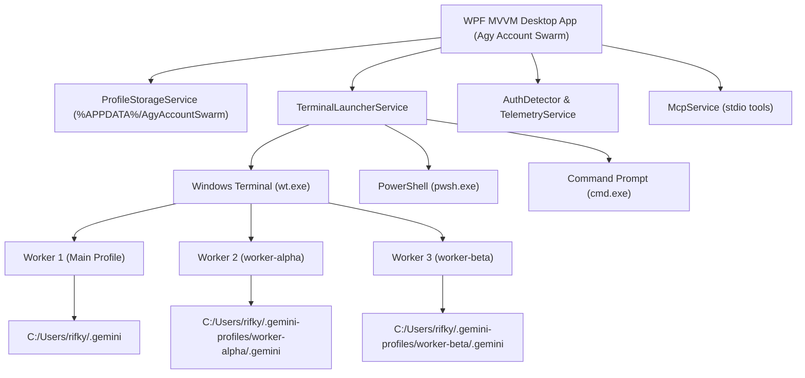

# Agy Account Swarm — Architecture & Technical Reference

## 1. System Philosophy

Google's Antigravity AI (`agy`) CLI was architected around a single local user model, persistently storing OAuth tokens, conversation transcripts, brain logs, and tool configurations under the host's root `%USERPROFILE%\.gemini` directory.

`Agy Account Swarm` provides non-invasive process and storage sandboxing without modifying binary code. By virtualizing environment variables and anchoring runtime state, it transforms the Antigravity CLI into an isolated multi-session agent workforce.



---

## 2. Directory Isolation Matrix

Each account maintains its own independent file tree:

| Target Component | Default Host Location | Swarm Isolated Location |
| :--- | :--- | :--- |
| **OAuth Token** | `~/.gemini/antigravity-cli/antigravity-oauth-token` | `~/.gemini-profiles/{id}/.gemini/antigravity-cli/antigravity-oauth-token` |
| **Active Identity** | `~/.gemini/google_accounts.json` | `~/.gemini-profiles/{id}/.gemini/google_accounts.json` |
| **Prompt History** | `~/.gemini/antigravity-cli/history.jsonl` | `~/.gemini-profiles/{id}/.gemini/antigravity-cli/history.jsonl` |
| **Model Config** | `~/.gemini/antigravity-cli/settings.json` | `~/.gemini-profiles/{id}/.gemini/antigravity-cli/settings.json` |
| **Session Brain** | `~/.gemini/antigravity-cli/brain/` | `~/.gemini-profiles/{id}/.gemini/antigravity-cli/brain/` |
| **Logs & Telemetry** | `~/.gemini/antigravity-cli/log/` | `~/.gemini-profiles/{id}/.gemini/antigravity-cli/log/` |

---

## 3. Environment Variable Virtualization

To avoid collision without administrator privileges, each spawned process receives localized variable overrides:

```cmd
@echo off
set "USERPROFILE=C:\Users\rifky\.gemini-profiles\worker-alpha"
set "HOME=C:\Users\rifky\.gemini-profiles\worker-alpha"
cd /d "D:\Works\TargetWorkspace"
agy
```

Because environment variables in Windows are inherited downward by child processes, the global Windows registry and other applications remain completely untouched.

---

## 4. Telemetry & History Engine

Unlike dummy statistical models, `Agy Account Swarm` parses real telemetry directly from local filesystem records:
- **`history.jsonl`**: Real-time line parsing extracting UTC unix millisecond timestamps, workspaces, and user queries.
- **`antigravity-oauth-token`**: Identity parsing extracting active authenticated Google email.
- **`app.log`**: Standardized file log recording launcher execution and exceptions.

---

## 5. Security & Privacy

1. **No External Telemetry**: The application does not send your OAuth tokens or private files anywhere outside your machine.
2. **Local Credential Storage**: All OAuth refresh and access tokens remain strictly in Google's encrypted and permissioned directory format.
3. **MIT License**: Open source code, allowing complete auditability.
