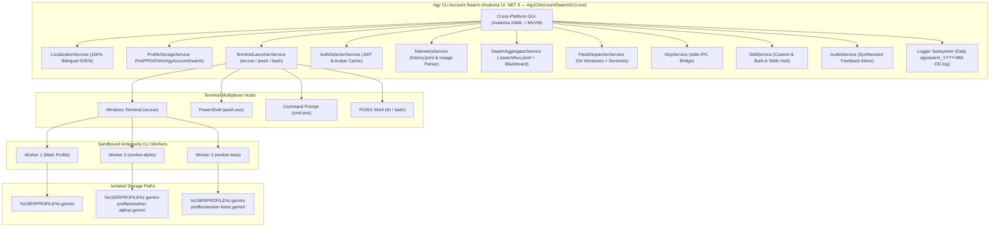

# Agy Account Swarm — Architecture & Technical Reference ⚡

## 1. System Philosophy

Google's Antigravity AI (`agy`) CLI was architected around a single local user model, persistently storing OAuth tokens, conversation transcripts, brain logs, and tool configurations under the host's root `%USERPROFILE%\.gemini` directory.

`Agy CLI Account Swarm` provides non-invasive process and storage sandboxing without modifying binary code. By virtualizing environment variables and anchoring runtime state, it transforms the Antigravity CLI into an isolated multi-session agent workforce.



---

## 2. Directory Isolation Matrix

Each account maintains its own independent file tree:

| Target Component | Default Host Location | Swarm Isolated Location |
| :--- | :--- | :--- |
| **OAuth Token** | `~/.gemini/antigravity-cli/antigravity-oauth-token` | `~/.gemini-profiles/{id}/.gemini/antigravity-cli/antigravity-oauth-token` |
| **Active Identity** | `~/.gemini/google_accounts.json` | `~/.gemini-profiles/{id}/.gemini/google_accounts.json` |
| **Prompt History** | `~/.gemini/antigravity-cli/history.jsonl` | `~/.gemini-profiles/{id}/.gemini/antigravity-cli/history.jsonl` |
| **Model Config** | `~/.gemini/antigravity-cli/settings.json` | `~/.gemini-profiles/{id}/.gemini/antigravity-cli/settings.json` |
| **Custom Skills** | `~/.gemini/antigravity-cli/skills/` | `~/.gemini-profiles/{id}/skills/` |
| **Session Brain** | `~/.gemini/antigravity-cli/brain/` | `~/.gemini-profiles/{id}/.gemini/antigravity-cli/brain/` |
| **Logs & Telemetry** | `~/.gemini/antigravity-cli/log/` | `~/.gemini-profiles/{id}/.gemini/antigravity-cli/log/` |

---

## 3. Environment Variable Virtualization & Keyring Decoupling

To avoid collision without administrator privileges, each spawned process receives localized variable overrides:

### Windows Batch Launcher (`run-agy.cmd`):
```cmd
@echo off
set "USERPROFILE=%USERPROFILE%\.gemini-profiles\worker-alpha"
set "HOME=%USERPROFILE%\.gemini-profiles\worker-alpha"
set "SSH_CONNECTION=1"
set "SSH_CLIENT=1"
cd /d "D:\Path\To\Workspace"
agy --dangerously-skip-permissions
```

### Key Technical Aspects:
1. **Keyring Decoupling (`SSH_CONNECTION=1`, `SSH_CLIENT=1`)**: Forces the Antigravity CLI into headless file-storage credential mode (`oauth_credentials.json`), preventing token leakage into the OS credential store or host environment.
2. **Inherited Scoping**: Because environment variables are inherited downward by child processes, the global Windows registry and other applications remain completely untouched.
3. **Workspace Trust**: Workspace trust configuration files are injected directly into each sandbox to prevent repetitive trust prompts on automated multi-agent dispatches.

---

## 4. Telemetry & History Engine

Unlike synthetic dummy statistical models, `Agy CLI Account Swarm` parses real telemetry directly from local filesystem records:
- **`agy -p "/usage" --output-format json`**: Fetches active 5-hour and weekly quota buckets with zero token consumption (`num_turns: 0`).
- **`history.jsonl`**: Real-time streaming parser extracting UTC millisecond timestamps, workspaces, and user queries with non-locking `FileShare.ReadWrite`.
- **JWT Decoding**: Safely decodes `id_token` claims for user email and avatar image URL, encrypted via native Windows DPAPI (`crypt32.dll`).
- **Structured Disk Logging**: Daily rotating logs (`agyswarm_YYYY-MM-DD.log`) under `%APPDATA%\AgyAccountSwarm\logs\`.

---

## 5. Real-Time Chat Studio & Inter-Agent Coordination

The Real-Time Chat Studio (`/realtime-chat`) serves as the central collaboration cockpit:
- **Event Bus Streaming (`.swarm/bus.jsonl`)**: An append-only event log monitored via a low-overhead, byte-offset `FileSystemWatcher`.
- **Live Output Stream Chips ("dia lagi ngapain")**: Dynamic chips and status banners displaying the exact shell command and real-time execution output for each active worker.
- **Shared Blackboard (`.swarm/blackboard.md`)**: Reactive markdown specification sheet shared among all workers for consensus coordination.
- **Human-in-the-Loop Steering**: Direct input bar allowing broadcast directives or targeted `@WorkerName` instructions.

---

## 6. Security & Privacy

1. **100% Local File Operations**: The application does not send OAuth tokens or private files anywhere outside your machine.
2. **Local Credential Storage**: All OAuth refresh and access tokens remain strictly in Google's permissioned directory format, protected at-rest via DPAPI.
3. **Secret Redaction**: Memory ring buffers and disk loggers automatically redact JWTs, bearer tokens, and OAuth keys before recording.
4. **MIT License**: Open source code, allowing complete auditability.

