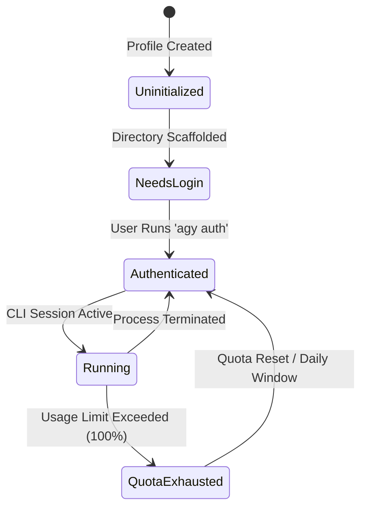

# Swarm Execution Workflows & Modes

## 1. Execution Modes

Agy Account Swarm supports three distinct window arrangements when launching accounts in batch:

### Mode 1: Split Panes (`wt.exe ; split-pane`)
Arranges all selected accounts into a tiled terminal matrix inside a single Windows Terminal instance. Ideal for side-by-side agent monitoring and comparing code refactors across models.

```bash
wt -w 0 new-tab -p "Command Prompt" -d "D:\Works\App1" cmd /k "C:\path\to\run-agy.cmd" ; split-pane -p "Command Prompt" -d "D:\Works\App2" cmd /k "C:\path\to\run-agy.cmd"
```

### Mode 2: Separate Tabs (`wt.exe ; new-tab`)
Spawns each profile into an independent tab within Windows Terminal. Best for developers who prefer focused full-screen terminal sessions.

### Mode 3: Separate Windows
Spawns completely decoupled Windows Terminal, PowerShell, or Command Prompt windows. Perfect for multi-monitor developer workstations.

---

## 2. Process Lifecycle & State Machine



1. **Uninitialized**: Directory not yet created.
2. **Needs Login**: Profile directory exists, awaiting Google OAuth token.
3. **Authenticated**: Active token verified; email and model detected.
4. **Quota Exhausted**: Real-time counter exceeds profile's configured quota threshold; audio and visual alert triggered.
