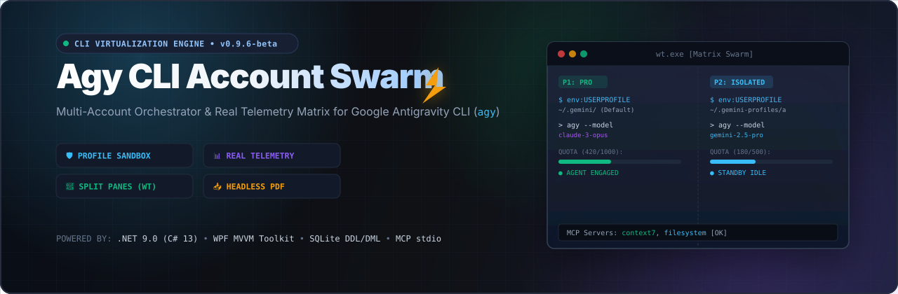
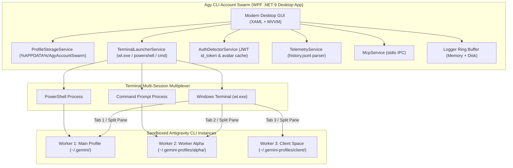

<p align="center">
  
</p>

# Agy CLI Account Swarm ⚡

> **A high-performance desktop orchestrator & sandbox session manager for Google Antigravity CLI (`agy`).**  
> Run multiple Antigravity AI agent sessions concurrently with strictly isolated Google accounts, authentic real-time telemetry, session turn tracking, and workspace sandboxing.

[](CHANGELOG.md)
[](https://dotnet.microsoft.com/)
[](https://avaloniaui.net/)
[]()
[](https://github.com/RifkyA911/agy-cli-account-swarm)
[]()

[](LICENSE)
[](https://github.com/RifkyA911)

---

> [!IMPORTANT]
> ### ⚠️ NOT THE ANTIGRAVITY IDE
> **Agy CLI Account Swarm** is specifically designed as a multi-account manager for the **Google Antigravity CLI (`agy`)** command-line interface. It is **NOT** the Antigravity IDE! It manages separate terminal CLI workers and sessions without modifying or interfering with your IDE setup.

> [!WARNING]
> ### 🖥️ GUI DESKTOP APPLICATION ONLY (STANDALONE CLI COMING IN 'agy-swarm')
> **Agy CLI Account Swarm** operates **strictly as a GUI Desktop Application** (built with WPF for Windows and Avalonia UI for cross-platform Linux/macOS on .NET 9).  
> **This repository is GUI-only and intentionally does not include a command-line interface.**  
> A standalone headless CLI orchestration interface will be published in a separate dedicated project named **`agy-swarm`**.  
> The desktop application serves as a visual control tower: you manage accounts, inspect live telemetry, filter profiles, migrate conversations, and launch separate terminal-based Antigravity CLI instances with a single click.

---

## 💡 Why Agy CLI Account Swarm?

Google's **Antigravity CLI (`agy`)** stores its OAuth credentials, conversation history, memory caches, and session configuration inside the host user's home directory (`~/.gemini/antigravity-cli`). Running multiple CLI terminal instances simultaneously on different Google accounts typically causes:

- **🔑 OAuth Credential Clashes**: Logging into one account in the CLI overwrites existing tokens in the Windows Credential Manager or `~/.gemini/` directory.
- **🔒 Process Lock Contention**: Fatal concurrency crashes on `presence/*.lock` and session database files.
- **📉 Quota Collisions**: Inability to parallelize development across distinct Google subscription tiers (Basic, Plus, Pro, Ultra).

**Agy CLI Account Swarm** solves this completely by:
1. Virtualizing environment variables (`USERPROFILE`, `HOME`) to dedicated, sandboxed folders (`~/.gemini-profiles/{id}`).
2. Decoupling the OS keyring via virtualized client parameters (`SSH_CONNECTION`, `SSH_CLIENT`), forcing `agy` to use isolated file-based credentials (`oauth_credentials.json`).
3. Reading and visualizing authentic telemetry parsed directly from local JSONL logs and JWT tokens with zero synthetic dummy data.

---

## ✨ Key Features & Capabilities

### ⚡ Fleet Prompt Dispatcher & Git Worktree Orchestration [EXPERIMENTAL]
- **Unified Objective, Multi-Worker Execution**: Enter a single high-level objective and distribute it across multiple authenticated `agy` CLI accounts simultaneously.
- **Zero-Dependency Native Architecture**: 100% C# / .NET 9 using the official `agy` CLI and Git CLI. No LangChain, LangGraph, or Python dependencies required.
- **Git Worktree Isolation**: Each account operates in an isolated Git worktree branch (`swarm/{worker}_{timestamp}`) referencing the shared repository, eliminating `.git/index.lock` collisions.
- **Pre-Flight Sentinel & Out-of-Resources Guard**: Automatically audits disk headroom (>= 2.0 GB required, warnings at < 5.0 GB) and memory availability before dispatching.
- **Graceful Fallback Mode**: If targeted outside a Git repository, automatically falls back to isolated per-worker sandboxes without failing.
- **3 Dispatch Paradigms**:
  - `RoleTailored`: Distributes specialized instructions per domain (Architect, Backend, Frontend, QA/Reviewer, Security Auditor).
  - `Consensus`: Runs divergent implementations (Approach A vs. Approach B vs. Critic) for competitive technical synthesis.
  - `Broadcast`: Sends identical prompts across all selected workers.
- **Clean Process Abort & Prune**: 1-click process tree kill terminating all active CLI instances, plus automated branch merging and worktree pruning.


### 🛡️ Sandboxing & Multi-Account Isolation
- **Per-Worker Profile Sandboxes**: Each profile operates in its own isolated folder (`~/.gemini-profiles/{id}/`) with independent OAuth tokens, conversation logs, and presence locks.
- **Keyring Decoupling & Token Preservation**: Prevents secondary accounts from inheriting the host Windows Credential Manager session. Tokens are preserved in pure UTF-8 JSON without BOM, guaranteeing complete persistence across swarm launches.
- **`--dangerously-skip-permissions` Toggle**: Dedicated checkbox card in Profile Configuration to bypass interactive tool, file write, and terminal confirmation prompts during automated swarm tasks.
- **Cross-Platform POSIX & Batch Launchers**: Every sandbox generates both `run-agy.cmd` (Windows) and `run-agy.sh` (Linux/macOS/WSL) with environment variable isolation.
- **Clean Profile Duplication**: 1-click clone feature (`📋 Duplicate`) to duplicate profile settings, model configurations, and workspace paths into dedicated isolated sandboxes without polluting the primary profile.
- **Far-Left Accounts Filter & Sort**: Interactive filter popup anchored on the far-left of the Accounts toolbar to slice accounts by Subscription Tier (Basic, Plus, Pro, Ultra), Status / Health (Authenticated, Needs Login, Quota Exhausted, Warning), and sort by Name or Quota Consumption.
- **Dedicated Single-Account Quick Sync**: Discrete refresh button on every account card header for on-demand OAuth & quota synchronization without triggering a full multi-account swarm scan.
- **Cross-Account Chat Migration (`Import Chat`)**: Migrate past conversation history, turn logs, and transcripts from one profile sandbox to another with 1-click, preserving developer context without violating Google authentication tokens.
- **Workspace Anchoring**: Configurable project workspaces per profile with automated path and quote escaping for spaces.

### 📊 Authentic Dynamic Telemetry & Quota Sentinels
- **Live CLI Telemetry Inspector (`/usage` & `/context`)**:
  - Embedded inspection cards inside each Account Card below a sleek divider.
  - **`/usage` Tab**: Real-time daily prompt quota consumption, current session turn counts, estimated swarm token metrics, and daily quota reset timer (00:00 UTC).
  - **`/context` Tab**: Dynamic model context window capacity (1M / 2M tokens), prompt context headroom, and cached context metrics.
- **Integrated In-Popup Searchable Conversation Selector**:
  - Search input box sits directly inside the dropdown popup (`HeroIconMagnifyingGlass`, live filter, and clear button), keeping the account card row completely clean.
  - Disabled discrete pixel jumping (`ScrollViewer.CanContentScroll="False"`) for butter-smooth mouse wheel scrolling.
  - Options include:
    - `✨ New Chat (Fresh Session)` (default launch)
    - `🔄 Continue Recent Session (/continue)`
    - `💻 Sandbox Terminal Shell (CLI Only - agy -p ready)` (drops into an isolated shell ready for scripts and prompt commands)
    - `💬 Resume Specific Conversation (--conversation <id>)`
- **Dynamic Swarm Lifecycle (Launch / Stop Swarm)**:
  - Tracks background worker terminal PIDs. Dynamically switches between emerald `Launch Swarm` and crimson `Stop Swarm` for 1-click instant termination.
- **Real-Time Swarm Status Dot**:
  - Glowing status dot on each avatar (emerald green for active swarm execution, slate gray when idle).
- **Dynamic Quota Usage Bar Colors**:
  - Emerald Green (< 70% quota used)
  - Amber Yellow (70% - 90% warning threshold)
  - Crimson Red (> 90% near exhaustion)
- **Authentic Google Profile Picture Extraction**:
  - Automatically parses the OAuth JWT `id_token` `picture` claim (`https://lh3.googleusercontent.com/a/...`) or local profile browser caches and stores photos to `%LOCALAPPDATA%\AgyAccountSwarm\avatars\`.
  - Generous 48px avatar column layout with fallback user initials and color-coded accents.
- **Tier-Aware Quotas & Reset Countdown**:
  - Quotas strictly match Google Antigravity tiers:
    - **Basic**: 100 prompts / 500K tokens per day
    - **Plus**: 300 prompts / 1.5M tokens per day
    - **Pro**: 1,000 prompts / 5M tokens per day
    - **Ultra**: 2,500 prompts / 15M tokens per day
  - Weekly remaining percentage badge calculated from authentic local telemetry.

### 🩺 Profile Doctor & Health Check
- Built-in 5-checkpoint diagnostic audit inspecting CLI binary path, OAuth authentication freshness, presence lock files, workspace trust status, and `/usage` schema compatibility.
- 1-click lock cleanup (`🧹 Clear Stuck Lock(s)`) to release locked worker processes.

### 📈 Expansive Interactive Charts & Analytics
- **Multi-Mode Visualizations**: Toggle between **Bar Chart**, **Line Chart**, and **Area Chart** with gradient fills.
- **Interactive Tooltips & Zoom**: Hover over any bar or node for detailed tooltips. Zoom In, Zoom Out, and Reset (`➖`, `➕`, `100%`) with smooth horizontal scrolling.
- **Generous Ceiling Headroom (+35%)**: Guarantees chart peaks and numerical labels never collide with the canvas ceiling.
- **24-Hour Swarm Heatmap**: Visualizes prompt execution intensity across every hour of the day.
- **Native PDF Report Export**: Zero-dependency vector PDF generation powered by Microsoft Edge headless engine (`msedge.exe --headless --print-to-pdf`).

### 🎨 Craft & System Integration
- **Custom Window Chrome**: Minimize (`🗕`), Maximize/Restore (`🗖`), and Close (`✕`) buttons, smooth drag-to-move, and double-click to toggle maximize.
- **System Tray Integration**: Configurable Close button behavior in Settings: choose between **Minimize to System Tray** or **Exit Application Completely**.
- **System OS Theme Auto-Detection**: Dynamically detects Windows Dark/Light mode from the registry, alongside 4 vibrant themes: **Obsidian Dark**, **Daylight Clean (Light)**, **Cyberpunk Neon**, and **Matrix Emerald**.
- **Crisp High-DPI Typography**: Powered by `Segoe UI Variable Text` and WPF `Display` text formatting with subpixel ClearType rendering.
- **Live Sync Pulsing Beacon & Audio Synthesizer**: Pulsing emerald green auto-sync badge in the top navigation bar with toggleable audio chimes (`AutoSyncAudioEnabled`).
- **Tailwind Heroicons Suite**: Modern vector icons across all navigation buttons, cards, and toolbars.
- **Comprehensive Logging Console (`/logs`)**: Thread-safe memory ring buffer with real-time log level filtering, search, and native Excel (`.xlsx`) export.
- **Dedicated About View (`/about`)**: Modern about page highlighting architectural pillars, project scope, and repository links.
- **Bilingual Interface**: Seamless runtime switching between **English (EN)** and **Bahasa Indonesia (ID)**.

---

## 🏗️ Architecture & Component Flow



### 🧠 Swarm Propagation Concepts (Architectural Roadmap)
How should propagation work across multiple sandboxed Antigravity CLI accounts?
1. **Configuration & Customization Propagation**:
   - Master-to-worker propagation of global `.gemini/settings.json`, custom rules (`GEMINI.md`), and MCP configurations (`mcp_config.json`) across all profile sandboxes with opt-out overrides.
2. **Context & Conversation Forking (Branch Propagation)**:
   - Branching an active conversation from Account A into Account B, C, and D to explore divergent coding solutions or benchmark different models concurrently without contaminating the parent chat.
3. **Prompt Fan-Out & Aggregation (Swarm Consensus Propagation)**:
   - Broadcast a single user prompt simultaneously across *N* selected profiles (e.g. Gemini 2.5 Pro vs Gemini 2.5 Flash), comparing output accuracy and response speeds in parallel.
4. **Dynamic Quota Failover Propagation (Rolling Relay)**:
   - Automated task handover: when Worker A encounters a 5-hour quota exhaustion or rate limit, pending tasks seamlessly propagate to Worker B with serialized conversation history transfer.

---

## 📦 Installation & Uninstallation Guide

### 🪟 Windows (Recommended)

#### Option A: Windows Installer (.exe Setup Wizard)
1. Download the latest installer from [GitHub Releases](https://github.com/RifkyA911/agy-cli-account-swarm/releases):
   ```
   Agy-CLI-Account-Swarm-Setup-v0.9.6-beta.exe
   ```
2. Double-click the `.exe` and follow the setup wizard.
3. The installer automatically:
   - Installs the application to your Program Files / AppData folder.
   - Creates a Start Menu shortcut and optional Desktop shortcut.
   - Registers the application in Windows **Installed Apps**.

#### How to Uninstall on Windows:
You can cleanly uninstall **Agy CLI Account Swarm** at any time through any of these methods:
- **Windows Settings**: Go to **Settings** > **Apps** > **Installed apps**, search for **Agy CLI Account Swarm**, and click **Uninstall**.
- **Start Menu**: Open the Start Menu, locate the **Agy CLI Account Swarm** folder, and click **Uninstall Agy CLI Account Swarm**.
- **Silent Uninstall** (for automation/scripting):
  ```powershell
  & "C:\Program Files\Agy CLI Account Swarm\unins000.exe" /VERYSILENT
  ```

#### Option B: Windows Portable ZIP (Zero Installation)
1. Download `Agy-CLI-Account-Swarm-v0.9.6-beta-win-x64.zip`.
2. Extract the archive to any folder of your choice.
3. Run `AgyAccountSwarm.exe`.
4. *To remove*: Simply delete the extracted folder.

---

### 🐧 Linux & 🍏 macOS Platform Status (Native Avalonia UI)

> [!NOTE]
> **Native Cross-Platform GUI is now available via Avalonia UI (`net9.0`)!**  
> Alongside the Windows WPF desktop edition (`AgyAccountSwarm`), the repository now includes `AgyAccountSwarm.Avalonia` targeting **.NET 9**.
>
> - **Linux Support**: Native rendering via Wayland / X11. Automated POSIX terminal dispatching (`ptyxis`, `gnome-terminal`, `konsole`, `xfce4-terminal`, `alacritty`, `kitty`, `xterm`, or `$TERMINAL`), POSIX sandbox launcher (`run-agy.sh` with `chmod +x`), and file manager integration via `xdg-open`.
> - **macOS Support**: Native rendering via Metal / Cocoa. Automated terminal dispatching via AppleScript (`osascript` to Terminal.app), Homebrew binary resolution (`/opt/homebrew/bin/agy`), and file manager integration via `open`.
> - **How to Run on Linux / macOS**:
>   ```bash
>   dotnet run --project AgyAccountSwarm.Avalonia/AgyAccountSwarm.Avalonia.csproj
>   ```
> - **Standalone Release Publish**:
>   ```bash
>   # Linux x64
>   dotnet publish AgyAccountSwarm.Avalonia/AgyAccountSwarm.Avalonia.csproj -c Release -r linux-x64 --self-contained -o publish/linux
>
>   # macOS Apple Silicon
>   dotnet publish AgyAccountSwarm.Avalonia/AgyAccountSwarm.Avalonia.csproj -c Release -r osx-arm64 --self-contained -o publish/macos
>   ```

---

## 🛠️ Building from Source & Compiling Installers

### Prerequisites
- **Windows 10 / 11** (64-bit)
- **.NET 9 SDK**: `winget install Microsoft.DotNet.SDK.9`
- **Inno Setup 6** *(Optional, for compiling Windows .exe installer)*: `winget install JRSoftware.InnoSetup`

### 1. Clone & Build
```powershell
# Clone repository
git clone https://github.com/RifkyA911/agy-cli-account-swarm.git
cd agy-cli-account-swarm

# Run unit tests (71 tests)
dotnet test

# Build and run desktop app
dotnet run --project AgyAccountSwarm.csproj
```

### 2. Compile Release Packages & Inno Setup Installer
Run the automated packaging script:
```powershell
powershell -ExecutionPolicy Bypass -File scripts\build-installer.ps1 -Version "0.9.6-beta"
```
This script will automatically:
1. Publish release binaries to `publish/`.
2. Compile `dist/Agy-CLI-Account-Swarm-Setup-v0.9.6-beta.exe` with embedded uninstaller using Inno Setup.
3. Package portable `dist/Agy-CLI-Account-Swarm-v0.9.6-beta-win-x64.zip`.
4. Generate `dist/SHA256SUMS.txt`.

---

## 🏷️ GitHub Releases & Versioning

Releases follow [Semantic Versioning](https://semver.org/). Pre-1.0 releases are designated with `-beta`:
- Current Beta: **`v0.9.6-beta`**

### Creating a New GitHub Release Tag:
Pushing a version tag to GitHub triggers the automated GitHub Actions workflow (`.github/workflows/release.yml`), which tests, builds, and publishes all installer assets:
```bash
git tag v0.9.6-beta
git push origin v0.9.6-beta
```

---

## ⚖️ Terms of Service, Google Policies & Risk Advisory

This application orchestrates local Antigravity CLI sessions and parses telemetry strictly from your local computer. For a full breakdown of policies and risk management:

👉 Read the comprehensive policy document: [`docs/TERMS_OF_SERVICE_AND_RISKS.md`](docs/TERMS_OF_SERVICE_AND_RISKS.md)

### Key Safety Principles:
1. **100% Local File Operations**: Quota metrics, session history, and chat imports read or copy local files on your machine. No synthetic data is generated, and no OAuth tokens are ever copied or shared across profiles.
2. **Respect Google Rate Limits**: Google enforces rolling 5-hour and weekly capacity limits across tiers. Use the live model quota monitors on each account card to distribute work fairly and prevent service throttling.
3. **Independent Third-Party Software**: Agy CLI Account Swarm is not affiliated with or endorsed by Google LLC. Users remain responsible for complying with Google's Terms of Service and Generative AI Prohibited Use Policies.
4. **GUI-Only Desktop Architecture**: This tool is strictly a graphical desktop orchestrator. A headless CLI runner will be provided in the future standalone project **`agy-swarm`**.

---

## 📖 Technical Reference & Documentation

### 🏛️ Core Architecture & Security
- [`docs/ARCHITECTURE.md`](docs/ARCHITECTURE.md): Deep-dive into process sandboxing, environment variable virtualization, and process tree architecture.
- [`docs/SECURITY_ISOLATION.md`](docs/SECURITY_ISOLATION.md): Operating system keyring decoupling (`SSH_CONNECTION=1`), BOM-free token preservation, DPAPI protection, and secret redaction.
- [`docs/CONFIG_REFERENCE.md`](docs/CONFIG_REFERENCE.md): Authoritative schema reference for `settings.json`, `profiles.json`, `quota_config.json`, and directory resolution rules.
- [`docs/DATABASE_CONFIG.md`](docs/DATABASE_CONFIG.md): SQLite persistence schema, session summaries (`conversation_summaries.db`), and JSON models.

### 🚀 Swarm Operations & Orchestration
- [`docs/SWARM_WORKFLOW.md`](docs/SWARM_WORKFLOW.md): Terminal multiplexing state machine, split-pane layout algorithms, and swarm lifecycle management (Launch & Stop Swarm).
- [`docs/CLI_REFERENCE.md`](docs/CLI_REFERENCE.md): Antigravity CLI flags (`agy`, `-p "/usage"`, `--dangerously-skip-permissions`), launcher script structure (`run-agy.cmd` / `run-agy.sh`), and environment contracts.
- [`docs/CHAT_MIGRATION_GUIDE.md`](docs/CHAT_MIGRATION_GUIDE.md): Cross-account conversation transfer, trajectory cloning, and context resumption with 100% credential segregation.
- [`docs/MCP_GUIDE.md`](docs/MCP_GUIDE.md): Model Context Protocol (MCP) per-worker isolation, global vs profile tool scopes, and stdio IPC bridge.
- [`docs/SCRIPTS_AND_AUTOMATION.md`](docs/SCRIPTS_AND_AUTOMATION.md): Reference for maintenance, build, setup, and cleanup automation scripts (`scripts/`).

### 🩺 Health, Telemetry & Diagnostics
- [`docs/PROFILE_DOCTOR.md`](docs/PROFILE_DOCTOR.md): Automated 5-checkpoint diagnostic audit, lingering lock cleaner, workspace trust registration, and self-healing engine.
- [`docs/TELEMETRY_PIPELINE.md`](docs/TELEMETRY_PIPELINE.md): Authentic real-time telemetry ingestion (`/usage`, `history.jsonl`, JWT claims), tier sentinels, and Excel/PDF export pipelines.
- [`docs/TROUBLESHOOTING.md`](docs/TROUBLESHOOTING.md): Comprehensive diagnostic matrix and solutions for binary paths, BOM errors, batch syntax, lingering locks, and High-DPI font sharpness.

### ⚖️ Policies, Roadmaps & Releases
- [`docs/TERMS_OF_SERVICE_AND_RISKS.md`](docs/TERMS_OF_SERVICE_AND_RISKS.md): Google Terms of Service, Generative AI Prohibited Use Policies, credential boundaries, and risk advisory.
- [`docs/NEXT_FEATURES.md`](docs/NEXT_FEATURES.md): Swarm propagation architecture, Git Worktree parallelization, and inflow roadmap.
- [`docs/CROSS_PLATFORM_AVALONIA_ROADMAP.md`](docs/CROSS_PLATFORM_AVALONIA_ROADMAP.md): Cross-platform Linux GUI (Avalonia UI 11+) migration roadmap and macOS feasibility evaluation.
- [`CHANGELOG.md`](CHANGELOG.md): Complete chronological release history and feature changelog.

---

## 🤝 Open Source & Contributing

Contributions, feedback, and issue reports are warmly welcomed!
- **GitHub Repository**: [https://github.com/RifkyA911/agy-cli-account-swarm](https://github.com/RifkyA911/agy-cli-account-swarm)
- **Issues & Feedback**: [https://github.com/RifkyA911/agy-cli-account-swarm/issues](https://github.com/RifkyA911/agy-cli-account-swarm/issues)
- **Author**: [RifkyA911](https://github.com/RifkyA911)

---

## 📄 License

This project is licensed under the [MIT License](LICENSE) — Copyright (c) 2026 RifkyA911.
