<p align="center">
  
</p>

# Agy CLI Account Swarm ⚡

> **A high-performance desktop orchestrator & sandbox session manager for Google Antigravity CLI (`agy`).**  
> Run multiple Antigravity AI agent sessions concurrently with strictly isolated Google accounts, authentic real-time telemetry, session turn tracking, and workspace sandboxing.

[](CHANGELOG.md)
[](https://dotnet.microsoft.com/)
[](https://avaloniaui.net/)
[]()
[]()
[](https://github.com/RifkyA911/agy-cli-account-swarm)
[]()
[]()
[](LICENSE)
[](https://github.com/RifkyA911)

---

> [!IMPORTANT]
> ### ⚠️ NOT THE ANTIGRAVITY IDE
> **Agy CLI Account Swarm** is specifically designed as a multi-account manager for the **Google Antigravity CLI (`agy`)** command-line interface. It is **NOT** the Antigravity IDE! It manages separate terminal CLI workers and sessions without modifying or interfering with your IDE setup.

> [!NOTE]
> ### 🖥️ PRIMARY FLAGSHIP: AVALONIA UI CROSS-PLATFORM (`AgyCliAccountSwarmGUI.exe`)
> **Agy CLI Account Swarm (Avalonia Edition)** is the sole active flagship desktop application (`AgyCliAccountSwarmGUI.exe`), delivering cross-platform rendering (Windows, Linux, macOS), modern high-contrast transparent outline controls, interactive node graphs, high-DPI font rendering, balanced ergonomic window scaling (`1240x660`), and responsive MVVM architecture.  
> The legacy Windows Presentation Foundation (WPF) codebase has been **completely archived as an internal pseudo prototype** for historical inspection.

---

## 💡 Why Agy CLI Account Swarm?

Google's **Antigravity CLI (`agy`)** stores its OAuth credentials, conversation history, memory caches, and session configuration inside the host user's home directory (`~/.gemini/antigravity-cli`). Running multiple CLI terminal instances simultaneously on different Google accounts typically causes:

- **🔑 OAuth Credential Clashes**: Logging into one account in the CLI overwrites existing tokens in the Windows Credential Manager or `~/.gemini/` directory.
- **🔒 Process Lock Contention**: Fatal concurrency crashes on `presence/*.lock` and session database files.
- **📉 Quota Collisions**: Inability to parallelize development across distinct Google subscription tiers (Basic, Plus, Pro, Ultra).

**Agy CLI Account Swarm** solves this completely by:
1. Virtualizing environment variables (`USERPROFILE`, `HOME`) to dedicated, sandboxed folders (`~/.gemini-profiles/{id}`).
2. Decoupling the OS keyring via virtualized client parameters (`SSH_CONNECTION=1`, `SSH_CLIENT=1`), forcing `agy` to use isolated file-based credentials (`oauth_credentials.json`).
3. Reading and visualizing authentic telemetry parsed directly from local JSONL logs and JWT tokens with zero synthetic dummy data.
4. **🌐 100% Bilingual Localization (Indonesian 🇮🇩 & English 🇬🇧)**: Complete native localization coverage with instant live switching without restart.
5. **💬 Unified Chat Hub (`/chat`) with Prominent Mode Switcher**: Comprehensive workspace combining Real-Time Swarm Chat (multi-agent bus stream, broadcast dispatch, architecture blackboard) and Personal 1-on-1 Chat (dynamic runtime model discovery from `agy models`, verified `low|medium|high` reasoning effort, multi-turn memory, authentic CLI history sync from `history.jsonl`, live task awareness, and active document indexing with 1-9ms hybrid project RAG via local Rust `arag-cli`), switched effortlessly via a responsive collision-free top mode switcher.
6. **📡 Live Activity Telemetry ("dia lagi ngapain")**: Authentic real-time command tracking and live output chips showing exactly what each worker is executing.
7. **🧩 Antigravity Skills Hub & Multi-Scope Discovery**: Inspect built-in, workspace, plugin, and per-profile skills schemas with explicit ownership, accessibility tags, and full Markdown modal preview.
8. **🔊 Sonic Sentinels & Optional Periodic Audio**: Synthesized audio alerts on swarm lifecycle events with configurable silent background periodic sync.

---

## 📸 Application Interface & Visual Tour

Explore the primary menus and interfaces of **Agy CLI Account Swarm**:

### 1. Swarm Executive Dashboard
The centralized mission-control cockpit showing active fleet capacity, authentic token metrics, interactive headroom bar/line charts with zoom and pan controls, and real-time auto-sync status.

<p align="center">
  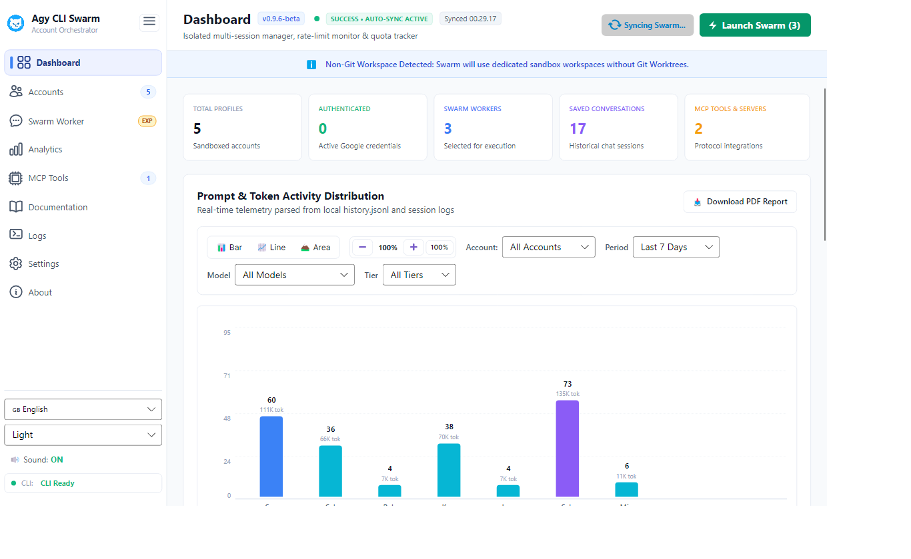
</p>

- **Fleet Health & Metric Pills**: Instant count of sandboxed profiles, authenticated credentials, selected execution workers, and active MCP integrations.
- **Interactive Headroom Visualizer**: Dynamic Bar, Line, and Area charts with +35% ceiling headroom, zoom in/out controls, and account/period slicing.
- **Dynamic Startup Auto-Sync**: Background synchronization initiates seamlessly upon app launch with zero CLI window flicker and a spinning status indicator.

---

### 2. Multi-Account Sandboxes & Telemetry Inspector
Manage isolated account profiles with authentic Google avatar rendering, subscription tier badges, health checks, and inline `/usage` and `/context` telemetry cards.

<p align="center">
  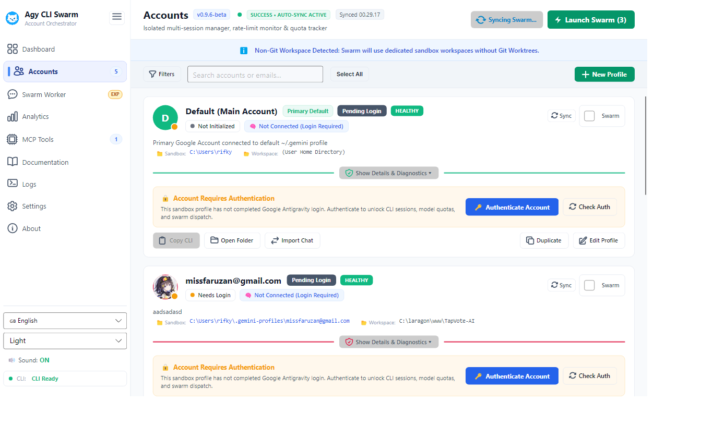
</p>

- **Crisp High-DPI Avatars**: Renders authentic Google profile pictures (`id_token` picture claims) with anti-aliased circular clipping and fallback color tags.
- **Far-Left Slicing & Filters**: Filter accounts by tier (Basic, Plus, Pro, Ultra), status (Authenticated, Needs Login, Warning), or sort by quota consumption.
- **Detailed Diagnostics Drawer**: One-click inspection of active model quotas, reset countdowns (00:00 UTC), and conversation history.

---

### 3. Swarm Fleet Workers & Terminal Multiplexer
Configure multi-worker execution rosters and dispatch terminal layouts across Windows Terminal split panes, separate tabs, or standalone windows.

<p align="center">
  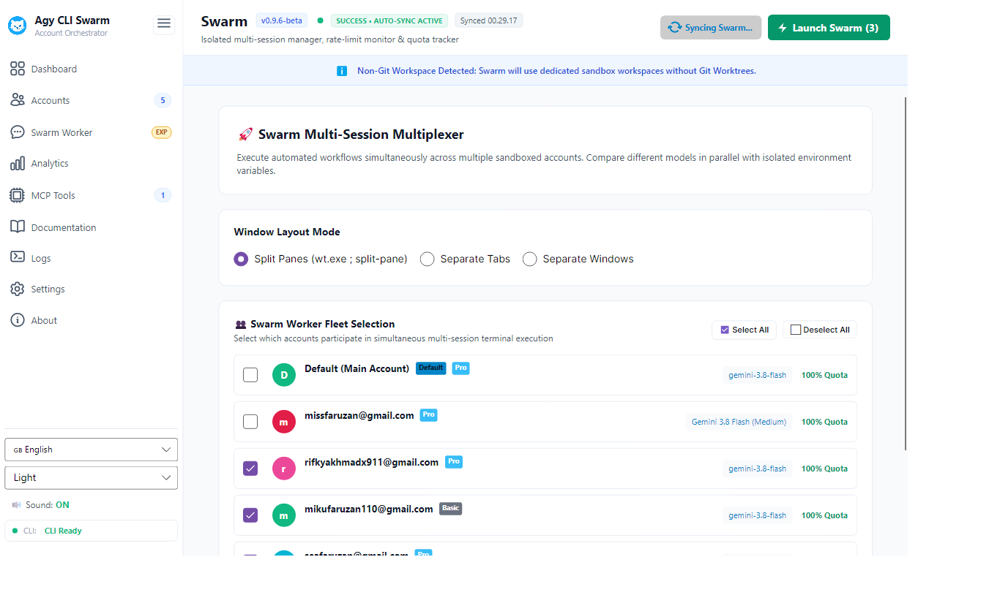
</p>

- **Multiplexer Layout Modes**: Choose between `Split Panes` (`wt.exe ; split-pane`), `Separate Tabs`, or `Separate Windows`.
- **Dedicated Orchestrator Controls Row**: Clean, unified toolbar grouping layout modes with Run and Stop Swarm action buttons.
- **Active Execution Sentinels**: Tracks background worker terminal PIDs for clean, single-click process tree termination.

---

### 4. Fleet Prompt Dispatcher & Objectives [EXPERIMENTAL]
Autonomous multi-worker execution engine that distributes high-level technical objectives across parallel `agy` workers.

<p align="center">
  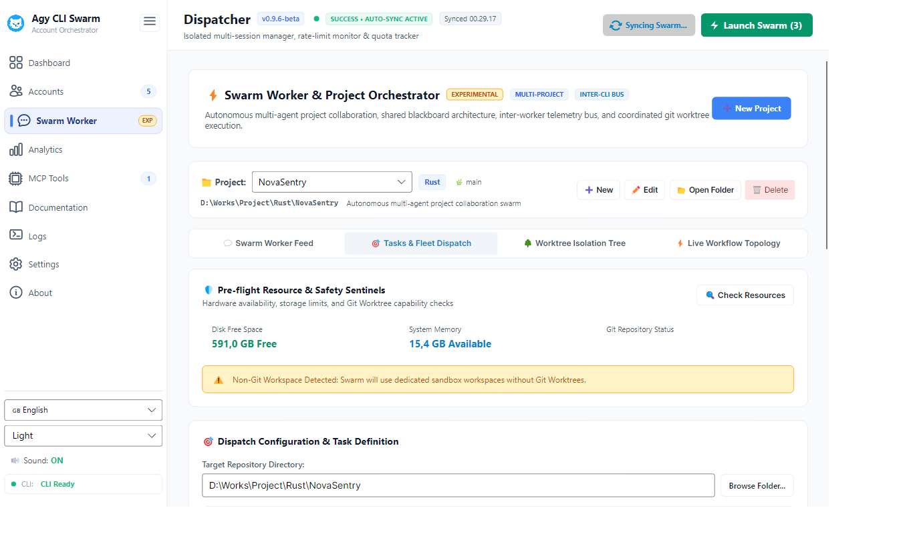
</p>

- **Pre-Flight Hardware Sentinels**: Automatic disk headroom audits (>= 2.0 GB required) and memory availability checks before launching agents.
- **3 Dispatch Paradigms**:
  - `RoleTailored`: Specializes instructions per domain (Architect, Backend, Frontend, QA, Security).
  - `Consensus`: Runs divergent implementations (Approach A vs Approach B vs Critic) for competitive synthesis.
  - `Broadcast`: Sends identical instructions across all selected workers.
- **Target Repository & Workspace Binding**: Integrates directly with target git repositories or dedicated local sandboxes.

---

### 5. Dedicated Real-Time Chat Studio (`/realtime-chat`) & Event Bus
Real-time collaborative chat workspace streaming live messages from the append-only `.swarm/bus.jsonl` event bus, human-in-the-loop directives, and individual account session streams.

<p align="center">
  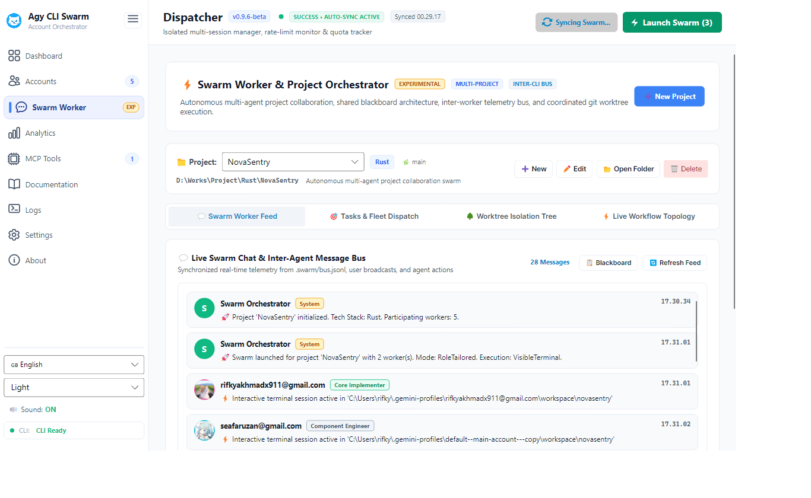
</p>

- **Dedicated Chat Workspace (`/realtime-chat`)**: Full workspace view with responsive channels, quick tips, interactive blackboard specs, and profile shortcuts (`💬 Chat Realtime`).
- **Live Output Stream Chips ("dia lagi ngapain")**: Dynamic chips and status banners displaying the exact shell command and real-time execution output for each active worker.
- **Distinct Role Badges & Avatars**: Color-coded badges differentiating System, User/Commander, Architect, Implementer, Reviewer, and Security roles with crisp circular avatars.
- **Reactive Stream Watching**: Low-overhead `FileSystemWatcher` with byte-offset tracking renders new worker events with zero polling overhead.
- **Human Directive Bar**: Send broadcasts to the entire swarm or target specific agents (`@WorkerName`) directly from the input bar.

---

### 6. Real-Time Swarm Workflow Topology
An n8n-inspired reactive node canvas visualizing project triggers, standby worker pools, telemetry pipelines, and aggregator nodes.

<p align="center">
  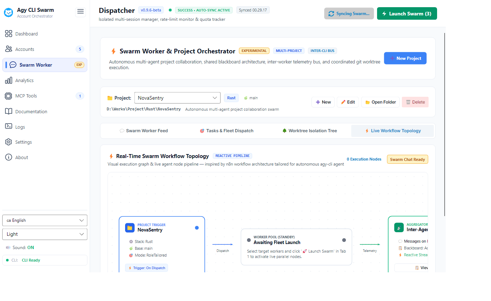
</p>

- **Dot-Grid Mesh Canvas**: High-contrast dark/light dot grid background providing spatial depth for workflow elements.
- **Smooth Drag-to-Move Hand Panning**: Intuitive mouse drag navigation and mouse wheel horizontal scrolling across large topology maps.
- **Live Status Badges**: Visual indicators reflecting current node execution states (Standby, Dispatched, Active).

---

### 7. Git Worktree Branch Isolation Tree
Topological view of the shared git repository root and isolated worker branch sandboxes.

<p align="center">
  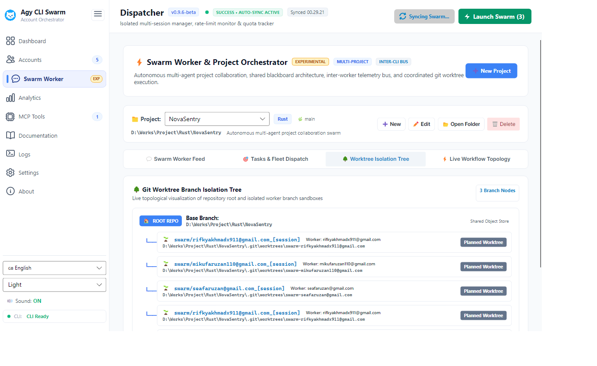
</p>

- **Zero Lock Contention**: Each worker operates in a separate branch worktree (`swarm/{worker}_{timestamp}`), eliminating `.git/index.lock` collisions.
- **Topological Branch Nodes**: Real-time status badges indicating planned, active, or merged worktrees.
- **Automatic Cleanup & Merge**: Automated pruning of temporary worktree directories after swarm task completion.

---

### 8. Telemetry Analytics & 24h Activity Heatmap
Deep-dive performance telemetry and prompt execution density across 24-hour cycles.

<p align="center">
  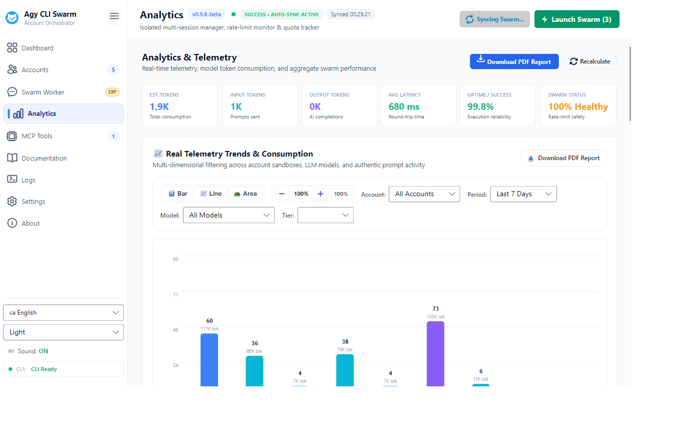
</p>

- **24-Hour Intensity Heatmap**: Hourly breakdown of prompt bursts, peak hours, and active execution windows.
- **Model Efficiency & Burn Rate**: Comparative metrics between Gemini Flash, Gemini Pro, and third-party models.
- **Zero Synthetic Data**: Every metric is calculated strictly from authentic local `history.jsonl` and JWT timestamps.

---

### 9. Model Context Protocol (MCP) Server Hub
Configure, manage, and audit Model Context Protocol (MCP) stdio server integrations across worker profiles.

<p align="center">
  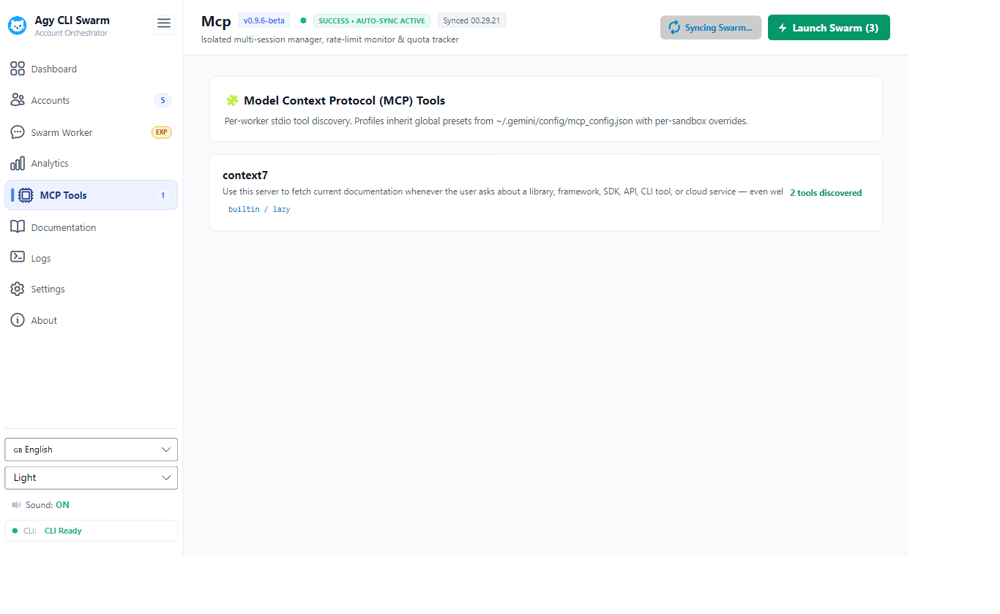
</p>

- **Global vs Profile Scope**: Attach MCP tools globally or scope them to specific worker sandboxes.
- **Tool Schema Inspection**: Audit available tool definitions, command arguments, and environment variables.
- **JSON Configuration Sync**: Automatically reflects settings in profile-specific `mcp_config.json` files.

---

### 10. Real-Time Execution Logs Console
Comprehensive logging and diagnostic subsystem with daily log file rotation, keyword search, level filtering, and Excel export.

<p align="center">
  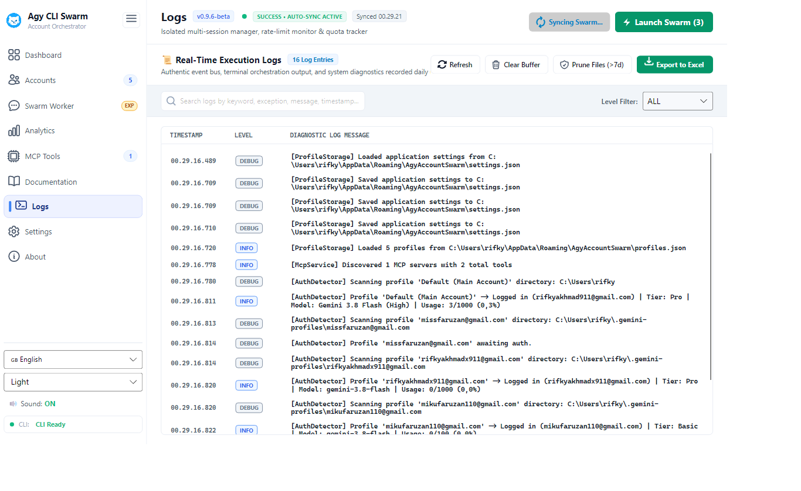
</p>

- **Daily Log File Rotation**: Logs are recorded daily to disk (`agyswarm_YYYY-MM-DD.log`) under `%APPDATA%\AgyAccountSwarm\logs\`.
- **Structured Badges & Filters**: Filter by log levels (`ALL`, `INFO`, `DEBUG`, `WARN`, `ERROR`, `SUCCESS`) or live keyword search.
- **Maintenance Actions**:
  - `Refresh`: Reload recent log buffer from disk.
  - `Clear Buffer`: Flush live memory buffer.
  - `Prune Files (>7d)`: Clean up historical log files older than 7 days.
  - `Export to Excel`: Export structured event logs to `.xlsx` with an interactive file destination picker.

---

### 11. System Settings & Preferences
Configure application behavior, window management, themes, and Antigravity CLI binary resolution.

<p align="center">
  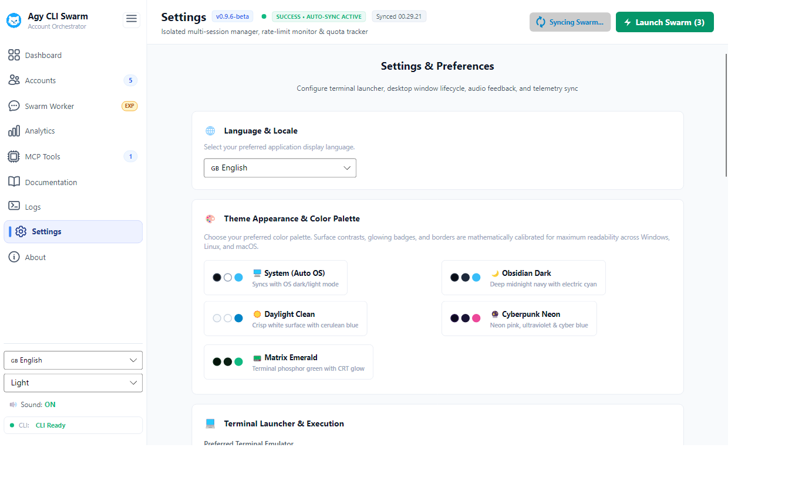
</p>

- **CLI Binary File Picker**: Locate and bind `agy.exe` via an interactive `Browse...` file picker dialog.
- **System Tray Behavior**: Configurable Close button action: minimize to system tray or exit application cleanly, with two-way toggle persistence.
- **Theme Color Palettes**: Toggle between `System (Auto OS)`, `Obsidian Dark`, `Daylight Clean`, `Cyberpunk Neon`, and `Matrix Emerald`.

---

## 🏗️ Architecture & Component Flow

```mermaid
flowchart TD
    subgraph DesktopGUI ["Agy CLI Account Swarm (Avalonia UI .NET 9 — AgyCliAccountSwarmGUI.exe)"]
        UI["Cross-Platform GUI (Avalonia XAML + MVVM)"]
        Loc["LocalizationService (100% Bilingual ID/EN)"]
        Storage["ProfileStorageService (%APPDATA%/AgyAccountSwarm)"]
        Launcher["TerminalLauncherService (Windows Terminal / PowerShell / POSIX)"]
        AuthDet["AuthDetectorService (JWT id_token & Avatar Cache)"]
        Telemetry["TelemetryService (history.jsonl & /usage Parser)"]
        SwarmBus["SwarmAggregatorService (.swarm/bus.jsonl + Blackboard)"]
        FleetDisp["FleetDispatcherService (Git Worktrees + Sentinels)"]
        Mcp["McpService (stdio IPC Bridge)"]
        Skills["SkillService (Custom & Builtin Skills Discovery)"]
        Audio["AudioService (Synthesized Feedback Alerts)"]
        PersonalChat["PersonalChatService (1-on-1 agy CLI Session Memory)"]
        Rag["RagService (Rust arag-cli 1-9ms Fast RAG Engine)"]
        DailyLog["Logger Subsystem (Daily agyswarm_YYYY-MM-DD.log)"]
        
        UI --> Loc
        UI --> Storage
        UI --> Launcher
        UI --> AuthDet
        UI --> Telemetry
        UI --> SwarmBus
        UI --> FleetDisp
        UI --> Mcp
        UI --> Skills
        UI --> Audio
        UI --> PersonalChat
        UI --> Rag
        PersonalChat --> Rag
        UI --> DailyLog
    end

    subgraph IsolationLayer ["Process & Credential Isolation Layer"]
        EnvVirt["Environment Virtualization (USERPROFILE & HOME)"]
        KeyringDecouple["Keyring Decoupling (SSH_CONNECTION=1)"]
        LauncherScripts["Per-Sandbox Launchers (run-agy.cmd / run-agy.sh)"]
        
        Launcher --> LauncherScripts
        LauncherScripts --> EnvVirt
        LauncherScripts --> KeyringDecouple
    end

    subgraph SandboxedWorkers ["Sandboxed Antigravity CLI Workers"]
        W1["Worker 1: Main (~/.gemini/)"]
        W2["Worker 2: Worker Alpha (~/.gemini-profiles/alpha/)"]
        W3["Worker 3: Worker Beta (~/.gemini-profiles/beta/)"]
        
        EnvVirt --> W1
        EnvVirt --> W2
        EnvVirt --> W3
    end

    subgraph SharedProject ["Shared Git Repository & Coordination Bus"]
        RepoRoot["Git Repository Root"]
        WT1["Worktree Branch 1 (.git/worktrees/w1)"]
        WT2["Worktree Branch 2 (.git/worktrees/w2)"]
        BusFile[".swarm/bus.jsonl (Inter-Agent Event Bus)"]
        Blackboard[".swarm/blackboard.md (Technical Specs)"]
        
        FleetDisp --> WT1
        FleetDisp --> WT2
        W1 --> BusFile
        W2 --> BusFile
        W3 --> BusFile
        W1 --> Blackboard
        SwarmBus --> BusFile
        SwarmBus --> Blackboard
    end
```

### 🔬 Technical Flow Breakdown

#### 1. Identity & Environment Virtualization
When launching a worker, `TerminalLauncherService` creates an isolated execution context by overriding:
- `USERPROFILE` and `HOME` set to `%USERPROFILE%\.gemini-profiles\{profile_id}`.
- `SSH_CONNECTION=1` and `SSH_CLIENT=1` to force the Antigravity CLI into headless file-storage credential mode (`oauth_credentials.json`), preventing token leakage into the OS credential store.
- `--dangerously-skip-permissions` flag generation when automated script confirmations are desired.

#### 2. Terminal Multiplexing & Process Tree Management
Workers are launched concurrently using native terminal multiplexers:
- **Windows Terminal (`wt.exe`)**: Dynamically constructs split-pane command chains (e.g. `wt.exe new-tab ; split-pane -H -d ... ; split-pane -V -d ...`).
- **Process Supervision**: Tracks worker PIDs and sub-processes in memory. On swarm abort or stop, all child `agy` processes are terminated gracefully without leaving zombie locks.

#### 3. Git Worktree Isolation Engine
For fleet tasks, `FleetDispatcherService` creates separate Git worktrees:
- Creates temporary branches `swarm/{worker}_{timestamp}` anchored to the shared repository.
- Each worker executes file edits and tests inside its own worktree folder, eliminating `.git/index.lock` collisions.
- Performs post-task diff inspection, optional automated branch merging, and clean worktree pruning.

#### 4. Inter-Worker Telemetry Bus (`.swarm/bus.jsonl`)
- Append-only event streaming connecting independent `agy` processes.
- Monitored by `SwarmAggregatorService` using a low-overhead, byte-offset `FileSystemWatcher`.
- Synchronizes worker progress, findings, error events, and technical directives with zero polling latency.

#### 5. Authentic Telemetry Pipeline
- Zero synthetic mock data. Telemetry is parsed directly from:
  - CLI `agy -p "/usage" --output-format json` outputs.
  - Local `history.jsonl` conversation records.
  - Decoded OAuth JWT tokens (`id_token` claims for user email and avatar image URL).

---

## 🛠️ Building & Running from Source

### Prerequisites
- **.NET 9 SDK**: `winget install Microsoft.DotNet.SDK.9`
- **Windows 10 / 11 (64-bit)**, **Linux (x64)**, or **macOS (Apple Silicon / x64)**
- **Antigravity CLI (`agy`)**: Installed and accessible in system `PATH` or configured via Settings.

### 1. Build & Run Desktop Application
```powershell
# Clone repository
git clone https://github.com/RifkyA911/agy-cli-account-swarm.git
cd agy-cli-account-swarm

# Run full test suite (162 tests passing)
dotnet test

# Run primary desktop GUI
dotnet run --project AgyAccountSwarm.Avalonia/AgyAccountSwarm.Avalonia.csproj
```

### 2. Standalone Release Publish
To produce the single production executable `AgyCliAccountSwarmGUI.exe`:
```powershell
dotnet publish AgyAccountSwarm.Avalonia/AgyAccountSwarm.Avalonia.csproj -c Release -o publish
```
The output executable will be located at:
```
publish\AgyCliAccountSwarmGUI.exe
```

---

## ⚖️ Terms of Service & Risk Advisory

This application orchestrates local Antigravity CLI sessions and parses telemetry strictly from your local computer. For a full breakdown of policies and risk management:

👉 Read the comprehensive policy document: [`docs/TERMS_OF_SERVICE_AND_RISKS.md`](docs/TERMS_OF_SERVICE_AND_RISKS.md)

### Key Safety Principles:
1. **100% Local File Operations**: Quota metrics, session history, and chat imports read or copy local files on your machine. No synthetic data is generated, and no OAuth tokens are ever shared across profiles.
2. **Respect Google Rate Limits**: Google enforces rolling 5-hour and weekly capacity limits across tiers. Use the live model quota monitors on each account card to distribute work fairly and prevent service throttling.
3. **Independent Third-Party Software**: Agy CLI Account Swarm is not affiliated with or endorsed by Google LLC. Users remain responsible for complying with Google's Terms of Service and Generative AI Prohibited Use Policies.

---

## 📖 Technical Reference & Documentation

### 🏛️ Core Architecture & Security
- [`docs/ARCHITECTURE.md`](docs/ARCHITECTURE.md): Deep-dive into process sandboxing, environment variable virtualization, and process tree architecture.
- [`docs/SECURITY_ISOLATION.md`](docs/SECURITY_ISOLATION.md): Keyring decoupling (`SSH_CONNECTION=1`), BOM-free token preservation, DPAPI protection, and secret redaction.
- [`docs/CONFIG_REFERENCE.md`](docs/CONFIG_REFERENCE.md): Authoritative schema reference for `settings.json`, `profiles.json`, `quota_config.json`, and directory resolution rules.
- [`docs/DATABASE_CONFIG.md`](docs/DATABASE_CONFIG.md): Persistence schema, session summaries (`conversation_summaries.db`), and JSON models.

### 🚀 Swarm Operations & Orchestration
- [`docs/SWARM_WORKFLOW.md`](docs/SWARM_WORKFLOW.md): Terminal multiplexing state machine, split-pane layout algorithms, and swarm lifecycle management (Launch & Stop Swarm).
- [`docs/CLI_REFERENCE.md`](docs/CLI_REFERENCE.md): Antigravity CLI flags (`agy`, `-p "/usage"`, `--dangerously-skip-permissions`), launcher script structure (`run-agy.cmd` / `run-agy.sh`), and environment contracts.
- [`docs/CHAT_MIGRATION_GUIDE.md`](docs/CHAT_MIGRATION_GUIDE.md): Cross-account conversation transfer, trajectory cloning, and context resumption.
- [`docs/MCP_GUIDE.md`](docs/MCP_GUIDE.md): Model Context Protocol (MCP) per-worker isolation, global vs profile tool scopes, and stdio IPC bridge.

### 🩺 Health, Telemetry & Diagnostics
- [`docs/PROFILE_DOCTOR.md`](docs/PROFILE_DOCTOR.md): Automated 5-checkpoint diagnostic audit, lingering lock cleaner, workspace trust registration, and self-healing engine.
- [`docs/TELEMETRY_PIPELINE.md`](docs/TELEMETRY_PIPELINE.md): Authentic real-time telemetry ingestion (`/usage`, `history.jsonl`, JWT claims), tier sentinels, and Excel/PDF export pipelines.
- [`docs/TROUBLESHOOTING.md`](docs/TROUBLESHOOTING.md): Comprehensive diagnostic matrix and solutions for binary paths, BOM errors, batch syntax, and lingering locks.

---

## 🤝 Open Source & Contributing

Contributions, feedback, and issue reports are warmly welcomed!
- **GitHub Repository**: [https://github.com/RifkyA911/agy-cli-account-swarm](https://github.com/RifkyA911/agy-cli-account-swarm)
- **Issues & Feedback**: [https://github.com/RifkyA911/agy-cli-account-swarm/issues](https://github.com/RifkyA911/agy-cli-account-swarm/issues)
- **Author**: [RifkyA911](https://github.com/RifkyA911)

---

## 📄 License

This project is licensed under the [MIT License](LICENSE) — Copyright (c) 2026 RifkyA911.
