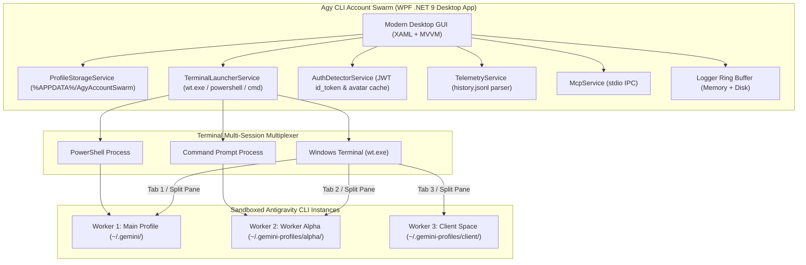

<p align="center">
  
</p>

# Agy CLI Account Swarm ⚡

> **A high-performance desktop orchestrator & sandbox session manager for Google Antigravity CLI (`agy`).**  
> Run multiple Antigravity AI agent sessions concurrently with strictly isolated Google accounts, authentic real-time telemetry, session turn tracking, and workspace sandboxing.

[](CHANGELOG.md)
[](https://dotnet.microsoft.com/)
[](https://learn.microsoft.com/en-us/dotnet/desktop/wpf/)
[]()
[](https://microsoft.com/windows)
[]()
[](LICENSE)
[](https://github.com/RifkyA911)

---

> [!IMPORTANT]
> ### ⚠️ NOT THE ANTIGRAVITY IDE
> **Agy CLI Account Swarm** is specifically designed as a multi-account manager for the **Google Antigravity CLI (`agy`)** command-line interface. It is **NOT** the Antigravity IDE! It manages separate terminal CLI workers and sessions without modifying or interfering with your IDE setup.

> [!WARNING]
> ### 🖥️ GUI DESKTOP APPLICATION MODE ONLY (NO CLI-ONLY INTERFACE YET)
> **Agy CLI Account Swarm** currently operates **strictly as a GUI Desktop Application** (built with WPF on .NET 9 for Windows).  
> **It does NOT yet support a headless CLI-only interface (`belum support interface cli only`).**  
> The desktop application serves as a visual control tower: you manage accounts, inspect live telemetry, select chat sessions, and launch separate terminal-based Antigravity CLI instances with a single click. (A headless CLI interface and Avalonia-based cross-platform GUI are planned on future milestones).

---

## 💡 Why Agy CLI Account Swarm?

Google's **Antigravity CLI (`agy`)** stores its OAuth credentials, conversation history, memory caches, and session configuration inside the host user's home directory (`~/.gemini/antigravity-cli`). Running multiple CLI terminal instances simultaneously on different Google accounts typically causes:

- **🔑 OAuth Credential Clashes**: Logging into one account in the CLI overwrites existing tokens in the Windows Credential Manager or `~/.gemini/` directory.
- **🔒 Process Lock Contention**: Fatal concurrency crashes on `presence/*.lock` and session database files.
- **📉 Quota Collisions**: Inability to parallelize development across distinct Google subscription tiers (Basic, Plus, Pro, Ultra).

**Agy CLI Account Swarm** solves this completely by:
1. Virtualizing environment variables (`USERPROFILE`, `HOME`) to dedicated, sandboxed folders (`~/.gemini-profiles/{id}`).
2. Decoupling the OS keyring via virtualized client parameters (`SSH_CONNECTION`, `SSH_CLIENT`), forcing `agy` to use isolated file-based credentials (`oauth_credentials.json`).
3. Reading and visualizing authentic telemetry parsed directly from local JSONL logs and JWT tokens with zero synthetic dummy data.

---

## ✨ Key Features & Capabilities

### 🛡️ Sandboxing & Multi-Account Isolation
- **Per-Worker Profile Sandboxes**: Each profile operates in its own isolated folder (`~/.gemini-profiles/{id}/`) with independent OAuth tokens, conversation logs, and presence locks.
- **Keyring Decoupling**: Prevents secondary accounts from inheriting the host Windows Credential Manager session.
- **Profile Duplication**: 1-click clone feature (`📋 Duplikat` / `Duplicate`) to instantly duplicate profile settings, model configurations, and workspace paths.
- **Workspace Anchoring**: Configurable project workspaces per profile with automated path and quote escaping for spaces.

### 📊 Authentic Dynamic Telemetry & Quota Sentinels
- **Live CLI Telemetry Inspector (`/usage` & `/context`)**:
  - Embedded inspection cards inside each Account Card below a sleek divider.
  - **`/usage` Tab**: Real-time daily prompt quota consumption, current session turn counts, estimated swarm token metrics, and daily quota reset timer (00:00 UTC).
  - **`/context` Tab**: Dynamic model context window capacity (1M / 2M tokens), prompt context headroom, and cached context metrics.
- **Chat Session Start / Resume Selector**:
  - Dropdown selector on every Account Card to choose launch behavior:
    - `✨ Start New Chat Session` (default launch)
    - `🔄 Continue Recent Chat (--continue)`
    - `💬 Resume Specific Conversation (--conversation <id>)`
- **Dynamic Quota Usage Bar Colors**:
  - Emerald Green (< 70% quota used)
  - Amber Yellow (70% - 90% warning threshold)
  - Crimson Red (> 90% near exhaustion)
- **Authentic Google Profile Picture Extraction**:
  - Automatically parses the OAuth JWT `id_token` `picture` claim (`https://lh3.googleusercontent.com/a/...`) and caches photos locally to `%LOCALAPPDATA%\AgyAccountSwarm\avatars\`.
  - Vibrant fallback avatar with user initials and color-coded accents for offline accounts.
- **Tier-Aware Quotas & Reset Countdown**:
  - Quotas strictly match Google Antigravity tiers:
    - **Basic**: 100 prompts / 500K tokens per day
    - **Plus**: 300 prompts / 1.5M tokens per day
    - **Pro**: 1,000 prompts / 5M tokens per day
    - **Ultra**: 2,500 prompts / 15M tokens per day
  - Weekly remaining percentage badge calculated from the last 7 days of local `history.jsonl` activity.

### 📈 Expansive Interactive Charts & Analytics
- **Multi-Mode Visualizations**: Toggle between **Bar Chart**, **Line Chart**, and **Area Chart** with gradient fills.
- **Interactive Tooltips & Zoom**: Hover over any bar or node for detailed tooltips. Zoom In, Zoom Out, and Reset (`➖`, `➕`, `100%`) with smooth horizontal scrolling.
- **Generous Ceiling Headroom (+35%)**: Guarantees chart peaks and numerical labels never collide with the canvas ceiling.
- **24-Hour Swarm Heatmap**: Visualizes prompt execution intensity across every hour of the day.
- **Native PDF Report Export**: Zero-dependency vector PDF generation powered by Microsoft Edge headless engine (`msedge.exe --headless --print-to-pdf`).

### 🎨 Craft & System Integration
- **Custom Window Chrome**: Minimize (`🗕`), Maximize/Restore (`🗖`), and Close (`✕`) buttons, smooth drag-to-move, and double-click to toggle maximize.
- **System Tray Integration**: Configurable Close button behavior in Settings: choose between **Minimize to System Tray** or **Exit Application Completely**.
- **System OS Theme Auto-Detection**: Dynamically detects Windows Dark/Light mode from the registry, alongside 4 vibrant themes: **Obsidian Dark**, **Daylight Clean (Light)**, **Cyberpunk Neon**, and **Matrix Emerald**.
- **Live Sync Pulsing Beacon & Audio Synthesizer**: Pulsing emerald green auto-sync badge in the top navigation bar with toggleable audio chimes (`AutoSyncAudioEnabled`).
- **Tailwind Heroicons Suite**: Modern vector icons across all navigation buttons, cards, and toolbars.
- **Comprehensive Logging Console (`/logs`)**: Thread-safe 1,000-line memory ring buffer with real-time log level filtering and search.
- **Bilingual Interface**: Seamless runtime switching between **English (EN)** and **Bahasa Indonesia (ID)**.

---

## 🏗️ Architecture & Component Flow



---

## 📦 Installation & Uninstallation Guide

### 🪟 Windows (Recommended)

#### Option A: Windows Installer (.exe Setup Wizard)
1. Download the latest installer from [GitHub Releases](https://github.com/RifkyA911/agy-cli-account-swarm/releases):
   ```
   Agy-CLI-Account-Swarm-Setup-v0.9.3-beta.exe
   ```
2. Double-click the `.exe` and follow the setup wizard.
3. The installer automatically:
   - Installs the application to your Program Files / AppData folder.
   - Creates a Start Menu shortcut and optional Desktop shortcut.
   - Registers the application in Windows **Installed Apps**.

#### How to Uninstall on Windows:
You can cleanly uninstall **Agy CLI Account Swarm** at any time through any of these methods:
- **Windows Settings**: Go to **Settings** > **Apps** > **Installed apps**, search for **Agy CLI Account Swarm**, and click **Uninstall**.
- **Start Menu**: Open the Start Menu, locate the **Agy CLI Account Swarm** folder, and click **Uninstall Agy CLI Account Swarm**.
- **Silent Uninstall** (for automation/scripting):
  ```powershell
  & "C:\Program Files\Agy CLI Account Swarm\unins000.exe" /VERYSILENT
  ```

#### Option B: Windows Portable ZIP (Zero Installation)
1. Download `Agy-CLI-Account-Swarm-v0.9.3-beta-win-x64.zip`.
2. Extract the archive to any folder of your choice.
3. Run `AgyAccountSwarm.exe`.
4. *To remove*: Simply delete the extracted folder.

---

### 🐧 Linux Installation & Uninstallation

> [!NOTE]
> The GUI is built on .NET 9 WPF. On Linux, the application runs seamlessly via Wine or .NET desktop runtime, while native Avalonia GUI support is planned.

1. Download `Agy-CLI-Account-Swarm-v0.9.3-beta-linux.tar.gz`.
2. Extract the archive:
   ```bash
   tar -xzf Agy-CLI-Account-Swarm-v0.9.3-beta-linux.tar.gz
   cd Agy-CLI-Account-Swarm-v0.9.3-beta-linux
   ```
3. Run the installer:
   ```bash
   chmod +x install.sh
   ./install.sh
   ```
   *(Installs to `~/.local/share/agy-cli-account-swarm` and adds `agy-cli-account-swarm` to your PATH and desktop menu)*.

#### How to Uninstall on Linux:
Run the uninstaller script created during installation:
```bash
~/.local/share/agy-cli-account-swarm/uninstall.sh
```

---

### 🍏 macOS Installation & Uninstallation

1. Download `Agy-CLI-Account-Swarm-v0.9.3-beta-macos.tar.gz`.
2. Extract the archive:
   ```bash
   tar -xzf Agy-CLI-Account-Swarm-v0.9.3-beta-macos.tar.gz
   cd Agy-CLI-Account-Swarm-v0.9.3-beta-macos
   ```
3. Run the installer:
   ```bash
   chmod +x install.sh
   ./install.sh
   ```
   *(Creates `Agy CLI Account Swarm.app` in `~/Applications` and symlinks `agy-cli-account-swarm` to PATH)*.

#### How to Uninstall on macOS:
Run the uninstaller script inside the application bundle:
```bash
~/Applications/"Agy CLI Account Swarm.app"/Contents/Resources/uninstall.sh
```

---

## 🛠️ Building from Source & Compiling Installers

### Prerequisites
- **Windows 10 / 11** (64-bit)
- **.NET 9 SDK**: `winget install Microsoft.DotNet.SDK.9`
- **Inno Setup 6** *(Optional, for compiling Windows .exe installer)*: `winget install JRSoftware.InnoSetup`

### 1. Clone & Build
```powershell
# Clone repository
git clone https://github.com/RifkyA911/agy-cli-account-swarm.git
cd agy-cli-account-swarm

# Run unit tests (43 tests)
dotnet test

# Build and run desktop app
dotnet run --project AgyAccountSwarm.csproj
```

### 2. Compile Release Packages & Inno Setup Installer
Run the automated packaging script:
```powershell
powershell -ExecutionPolicy Bypass -File scripts\build-installer.ps1 -Version "0.9.3-beta"
```
This script will automatically:
1. Publish release binaries to `publish/`.
2. Compile `dist/Agy-CLI-Account-Swarm-Setup-v0.9.3-beta.exe` with embedded uninstaller using Inno Setup.
3. Package portable `dist/Agy-CLI-Account-Swarm-v0.9.3-beta-win-x64.zip`.
4. Generate `dist/SHA256SUMS.txt`.

---

## 🏷️ GitHub Releases & Versioning

Releases follow [Semantic Versioning](https://semver.org/). Pre-1.0 releases are designated with `-beta`:
- Current Beta: **`v0.9.3-beta`**

### Creating a New GitHub Release Tag:
Pushing a version tag to GitHub triggers the automated GitHub Actions workflow (`.github/workflows/release.yml`), which tests, builds, and publishes all installer assets:
```bash
git tag v0.9.3-beta
git push origin v0.9.3-beta
```

---

## 📖 Technical Reference & Documentation

- [`docs/ARCHITECTURE.md`](docs/ARCHITECTURE.md): Deep-dive into process isolation and environment virtualization.
- [`docs/SWARM_WORKFLOW.md`](docs/SWARM_WORKFLOW.md): Terminal multiplexing state machine and split-pane layout algorithms.
- [`docs/MCP_GUIDE.md`](docs/MCP_GUIDE.md): Model Context Protocol configuration and dynamic tool discovery.
- [`docs/DATABASE_CONFIG.md`](docs/DATABASE_CONFIG.md): SQLite persistence schema, session summaries, and JSON structure.
- [`CHANGELOG.md`](CHANGELOG.md): Complete chronological release history and feature changelog.

---

## 🤝 Open Source & Contributing

Contributions, feedback, and issue reports are warmly welcomed!
- **GitHub Repository**: [https://github.com/RifkyA911/agy-cli-account-swarm](https://github.com/RifkyA911/agy-cli-account-swarm)
- **Issues & Feedback**: [https://github.com/RifkyA911/agy-cli-account-swarm/issues](https://github.com/RifkyA911/agy-cli-account-swarm/issues)
- **Author**: [RifkyA911](https://github.com/RifkyA911)

---

## 📄 License

This project is licensed under the [MIT License](LICENSE) — Copyright (c) 2026 RifkyA911.
