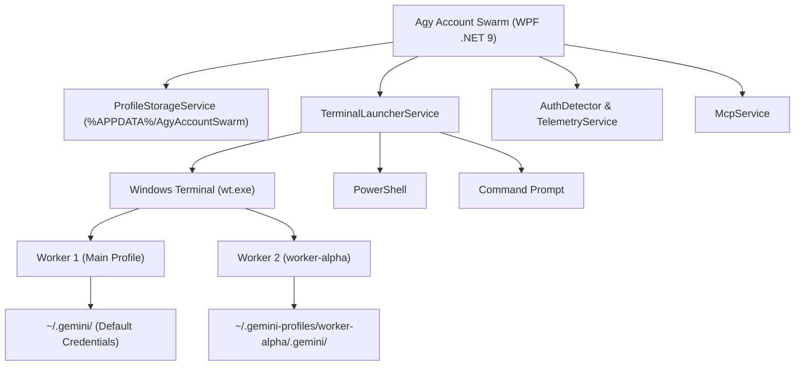

# Agy Account Swarm ⚡

> **A minimalist, high-performance desktop orchestrator & multi-account manager for Google Antigravity CLI (`agy`).**  
> Run multiple Antigravity AI agent sessions concurrently with strictly isolated Google accounts, real-time quota tracking, and workspace sandboxing.

[](https://dotnet.microsoft.com/)
[](https://learn.microsoft.com/en-us/dotnet/desktop/wpf/)
[]()
[](https://microsoft.com/windows)
[](LICENSE)
[](https://github.com/RifkyA911)

---

## 💡 Overview

Google's **Antigravity CLI (`agy`)** stores its OAuth tokens, history, and configuration inside the host user's home directory (`~/.gemini/antigravity-cli`). Running multiple CLI windows simultaneously on different Google accounts typically causes:

- **Auth Collisions**: One account's session overwrites the other's OAuth token.
- **Lock Contention**: Concurrency errors on `~/.gemini/antigravity-cli/presence/*.lock`.
- **Quota Clashes**: Inability to parallelize tasks across independent subscription quotas.

**Agy Account Swarm** solves this cleanly by virtualizing environment variables (`USERPROFILE` and `HOME`) to dedicated per-worker sandboxes (`~/.gemini-profiles/{id}`). Each profile operates with its own credentials, settings, and conversation logs, enabling **true parallel multi-agent execution**.

---

## ✨ Features

- **🛡️ Strict Environment Isolation**: Each profile points to its own sandbox (`~/.gemini-profiles/{id}`) with independent tokens, brain logs, and history files.
- **🌐 Bilingual Multi-Language Support**: Seamless instant switching between **English (EN - Default)** and **Bahasa Indonesia (ID)**.
- **📊 Real Telemetry & Multi-Mode Charts**:
  - Direct timestamp parsing from local `history.jsonl` (no synthetic dummy data).
  - Multi-mode rendering: **Bar Chart**, **Line Chart**, and **Area Chart** with gradient fills.
  - Interactive filters: Timeframe (*24h*, *7d*, *30d*, *All Time*), Model, and Tier.
- **🧩 Model Context Protocol (MCP) Manager**:
  - Live inspection and management of local MCP tool servers (`context7`, `filesystem`, etc.).
  - Automatic tool discovery and schema inspection.
- **🧠 Full Model Support (Including Claude Opus)**:
  - Supports `claude-3-opus`, `claude-3.5-sonnet`, `claude-3.7-sonnet`, `gemini-2.5-pro`, `gemini-2.5-flash`, `gemini-1.5-pro`, and `gpt-4o`.
- **🚨 Quota Exhaustion Alerts & Audio Synthesizer**:
  - High-visibility warning banner and synthesized acoustic alarm when an account reaches 100% daily quota.
  - In-memory synthesized audio tones for clicks, launches, sync droplet chimes, and soft welcome purrs.
- **🐱 Fluid Cat Welcome Animation**:
  - Elegant 3-second animated vector cat greeting on startup with satisfying fluffy purr chime.
- **🐝 Flexible Swarm Launch Arrangements**:
  - **Split Panes**: Auto-arranges parallel workers into a tiled matrix inside a single Windows Terminal.
  - **Separate Tabs**: Spawns workers as distinct tabs in Windows Terminal.
  - **Separate Windows**: Spawns decoupled windows for multi-monitor setups.
- **📖 Comprehensive In-App Documentation (`/docs`)**:
  - Built-in guides covering Architecture, Swarm Workflow, Data Storage schemas, and MCP integration.
- **🌓 Theme & System Tray**:
  - Instant toggle between Dark Mode and high-contrast Light Mode.
  - Background tray integration (Minimize to Tray and Close to Tray).

---

## 🏗️ System Architecture



---

## 🚀 Getting Started

### Prerequisites
- Windows 10 / 11 (64-bit)
- [.NET 9.0 Runtime](https://dotnet.microsoft.com/download/dotnet/9.0) (or [.NET 9.0 SDK](https://dotnet.microsoft.com/download/dotnet/9.0))
- [Antigravity CLI (`agy`)](https://antigravity.google/docs/cli) installed and in `PATH`
- *(Recommended)* [Windows Terminal](https://aka.ms/terminal) for split-pane matrix orchestration

### Running from Published Output
Pre-built executable binaries are located in the `publish/` directory:
```powershell
& "D:\Works\Project\C#\agy-cli-account-swarm\publish\AgyAccountSwarm.exe"
```

### Building from Source
```powershell
# Clone the repository
git clone https://github.com/RifkyA911/agy-cli-account-swarm.git
cd agy-cli-account-swarm

# Build solution
dotnet build AgyAccountSwarm.sln -c Release

# Run application
dotnet run --project AgyAccountSwarm.csproj
```

---

## 📖 In-App Documentation

- [`docs/ARCHITECTURE.md`](docs/ARCHITECTURE.md): Deep-dive into process isolation and environment virtualization.
- [`docs/SWARM_WORKFLOW.md`](docs/SWARM_WORKFLOW.md): Step-by-step launch state machine and terminal tiling.
- [`docs/MCP_GUIDE.md`](docs/MCP_GUIDE.md): Model Context Protocol configuration and tool discovery.

---

## 🤝 Open Source & Contributions

Contributions, bug reports, and feature requests are very welcome!  
Feel free to open an issue or pull request:

- **Repository**: [https://github.com/RifkyA911/agy-cli-account-swarm](https://github.com/RifkyA911/agy-cli-account-swarm)
- **Author**: [RifkyA911](https://github.com/RifkyA911)

---

## 📄 License

This project is licensed under the [MIT License](LICENSE) - Copyright (c) 2026 RifkyA911.
