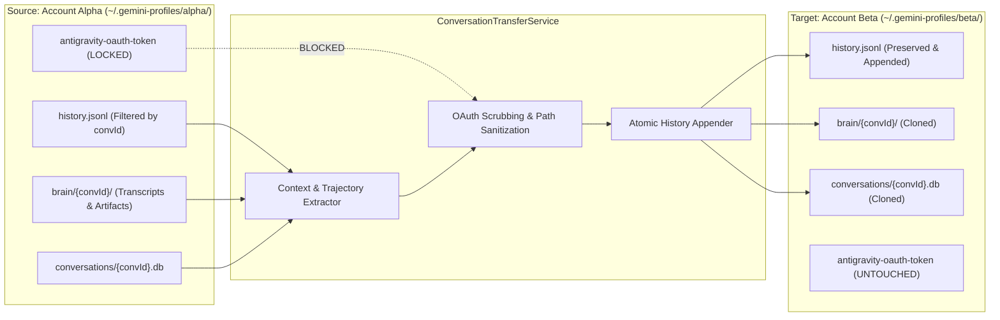

# Cross-Account Chat Migration & Conversation Transfer Guide 💬

> **Component**: `AgyAccountSwarm.Services.ConversationTransferService`  
> **Status**: Production (v0.9.6-beta+)  
> **Scope**: Seamless context migration between sandboxed Google Antigravity CLI accounts with 100% credential segregation.

---

## 📌 1. Purpose & Motivation

Developers utilizing multiple Antigravity AI accounts often run into the following workflow bottleneck:
1. **Quota Depletion**: You start an intensive architecture refactor on **Account Alpha (Pro Tier)**. After 80 turns, Account Alpha reaches its 5-hour rolling quota threshold.
2. **Context Fragmentation**: You want to continue the discussion on **Account Beta (Plus Tier)**, but starting from scratch requires re-explaining the entire codebase architecture, prior decisions, and debugging history.
3. **Authentication Clashing**: Manually copying files risks overwriting OAuth tokens or invalidating session databases.

**Chat Migration (`Import Chat`)** solves this seamlessly by transferring developer context, conversation turns, reasoning trajectories, and artifacts across sandboxes while guaranteeing zero credential cross-contamination.



---

## 🛡️ 2. Absolute Credential Segregation Guarantee

The migration pipeline operates under strict security and privacy boundaries:

1. **No Token Copying**: `antigravity-oauth-token`, `google_accounts.json`, and Windows Credential Manager entries are explicitly ignored and never read or written during migration.
2. **Local Disk Only**: All operations consist of local filesystem copies and string appends. No network requests are made, and no telemetry is transmitted.
3. **Target Identity Execution**: When Account Beta launches the migrated chat (`agy --conversation <convId>`), it authenticates exclusively via Account Beta's own Google account and consumes Account Beta's quota.

---

## 📂 3. Migrated File Inventory

When a conversation is transferred, `ConversationTransferService` synchronizes three discrete assets:

### 1. Prompt History Stream (`history.jsonl`)
- Filters the source `history.jsonl` line-by-line for records matching the target `conversationId`.
- Reads existing target `history.jsonl` to ensure identical prompt entries are not duplicated.
- Atomically appends missing records using UTF-8 encoding.

### 2. Conversation Brain Directory (`brain/{conversationId}/`)
- Recursively copies all trajectory artifacts from `source/.gemini/antigravity-cli/brain/{convId}/` to `target/.gemini/antigravity-cli/brain/{convId}/`:
  - `transcript.jsonl`: Step-by-step agent turn log, prompt tokens, thinking steps, and tool execution outputs.
  - `task.md` / `plan.md`: Agent planning state documents.
  - Generated code diffs and temporary scratch scripts.

### 3. Session SQLite Database (`conversations/*.db` / `conversation_summaries.db`)
- Copies the individual conversation SQLite file (`conversations/{convId}.db`) or copies the summary row from `conversation_summaries.db`.
- Preserves session title, total tokens used, and created/updated timestamps.

---

## 🖥️ 4. How to Migrate a Chat in the Desktop GUI

1. Open **Agy CLI Account Swarm**.
2. On any Account Card that needs past conversation context, click **📥 Import Chat** (located in the card toolbar).
3. The **Import Chat Dialog** opens:
   - **Source Profile**: Select the profile that owns the existing conversation.
   - **Conversation List**: Select the specific chat from the searchable list (displays title, turn count, and last active timestamp).
   - **Destination Profile**: Select the target account where the chat should be imported.
4. Click **🚀 Transfer Conversation**.
5. Once complete, you can click **Launch agy** with `--conversation <id>` on the target account to immediately continue the conversation.

---

## 💻 5. Programmatic API Reference

```csharp
public interface IConversationTransferService
{
    /// <summary>
    /// Discovers all available conversation sessions across a profile's history and database.
    /// </summary>
    Task<List<ConversationSessionItem>> GetProfileConversationsAsync(AccountProfile profile);

    /// <summary>
    /// Transfers all history logs, brain transcripts, and SQLite databases from source to target.
    /// </summary>
    Task<bool> TransferConversationAsync(
        AccountProfile sourceProfile,
        AccountProfile targetProfile,
        string conversationId,
        Action<string>? statusCallback = null);
}
```
