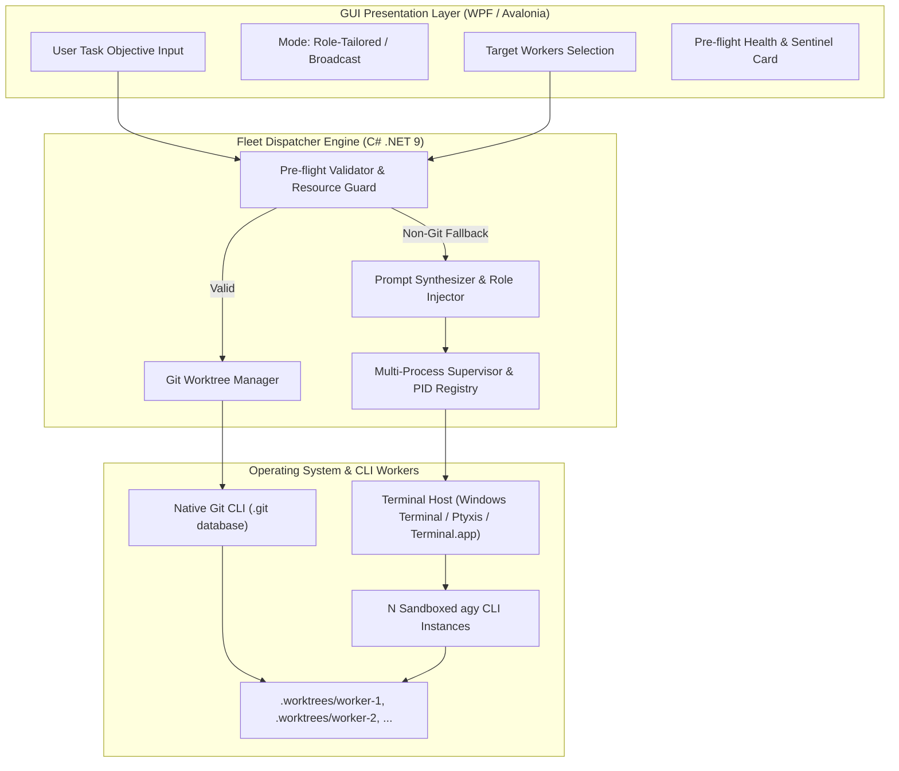

# Fleet Prompt Dispatcher & Git Worktree Orchestrator (Experimental)
## Technical Architectural Specification & Robustness Protocol

---

## 1. Executive Summary & Problem Space

In multi-agent collaborative workflows powered by the Google Antigravity (`agy`) CLI, launching multiple sandboxed worker accounts creates severe friction if executed naively:
1. **Interactive Manual Typing**: Users must navigate to $N$ separate terminal windows and redundantly re-type instructions into each CLI.
2. **Repository Lock Contention**: Concurrent edits in a shared working tree trigger fatal `.git/index.lock` collisions and race conditions.
3. **Resource Saturation**: Spawning multiple autonomous CLI agents concurrently risks CPU spikes, memory exhaustion, and disk starvation.
4. **Quota Volatility**: Workers unexpectedly exhausting their rolling 5-hour limit mid-task can stall pipelines without graceful failover.

The **Fleet Prompt Dispatcher** (`[EXPERIMENTAL]`) introduces an automated, resilient, and ToS-compliant orchestration layer:
- **1-Click Objective Dispatch**: Users enter a single task objective in the GUI, which is synthesized, role-tailored, and broadcast to $N$ workers.
- **Git Worktree Isolation**: Zero lock collisions; each worker operates in an isolated physical working tree linked to a unified `.git` object store.
- **Fail-Safe Robustness**: Exhaustive handling for fallbacks (non-git directories, missing terminals), errors (stale locks, subprocess crashes), warnings (quota exhaustion, uncommitted trees), and out-of-resources (OOR) guards (RAM, CPU, disk).

---

## 2. Core Architecture & Component Flow

---

## 3. Detailed Handling Matrix: Fallback, Error, Warn, Out-of-Resources

### 3.1 Fallback Handling (Graceful Degradation)

| Skenario Fallback | Deteksi Sistem | Mekanisme Fallback Otomatis |
| :--- | :--- | :--- |
| **Non-Git Workspace** | `git rev-parse --is-inside-work-tree` mengembalikan error / non-zero. | Otomatis mengalihkan ke mode **Dedicated Sandbox Workspace** (`~/.gemini-profiles/{id}/workspace`) tanpa memanggil perintah git. Banner peringatan ditampilkan di UI. |
| **Terminal Host Tidak Tersedia** | Host yang dipilih (misal `wt.exe`) tidak terpasang. | Cascading fallback sequence: • **Windows**: `wt.exe` ➔ `powershell.exe` ➔ `cmd.exe` • **Linux**: `$TERMINAL` ➔ `x-terminal-emulator` ➔ `ptyxis` ➔ `gnome-terminal` ➔ `konsole` ➔ `alacritty` ➔ `bash` • **macOS**: AppleScript `Terminal.app` ➔ `open -a Terminal` ➔ direct `bash`. |
| **Dirty Working Tree (Uncommitted Changes)** | `git status --porcelain` mendeteksi file modifikasi yang belum di-commit di branch aktif. | Sistem memberikan 2 opsi fallback: 1. **Auto-Stash**: `git stash push -m "agy-swarm-autostash"` sebelum membuat worktree, dan `git stash pop` setelahnya. 2. **Branch from HEAD**: Membuat worktree dari commit `HEAD` terakhir tanpa menyentuh working tree kotor. |
| **Quota Worker Exhausted Sebelum Dispatch** | Telemetri autentik mendeteksi `Gemini5HourRemainingPercent < 5%` atau `AuthStatus == QuotaExhausted`. | Otomatis mengecualikan akun yang habis kuota dari batch dispatch, memberikan notifikasi, dan merekomendasikan worker pengganti yang kuotanya masih segar. |

---

### 3.2 Error Handling & Resilience

| Kondisi Error | Akar Penyebab | Penanganan & Pemulihan Sistem |
| :--- | :--- | :--- |
| **Worktree Index Lock Collision** | File `.git/worktrees/<id>/locked` atau `index.lock` tertinggal akibat proses crash sebelumnya. | Menjalankan `git worktree prune` dan `git worktree unlock`. Jika file `.lock` tetap ada, `ProfileDoctorService` melakukan surgical unlock khusus worktree tersebut. |
| **Branch Name Collision** | Branch `swarm/<worker>` sudah ada dari sesi sebelumnya. | Menggunakan skema penamaan berbasis timestamp mikro: `swarm/{worker-name}_{yyyyMMdd_HHmmss}` sehingga dijamin 100% unik. |
| **Subprocess Crash / Non-Zero Exit** | `agy` CLI mengalami fatal error (misal token kedaluwarsa atau network failure). | Process Supervisor menangkap exit code dan stderr, mencatatnya ke ring-buffer log `/logs`, mematikan sub-proses anak yang menggantung, dan memperbarui status card di GUI ke `Failed`. |
| **Merge Conflicts pada Rekonsiliasi** | Dua worker mengubah baris kode yang sama pada file yang sama. | Sistem **TIDAK** memaksakan `git merge --force`. Sistem menghentikan merge dengan status `Conflict Detected`, menampilkan file yang berkonflik, dan membiarkan user memilih resolusi (Keep Worker A, Keep Worker B, atau buka diff editor). |

---

### 3.3 Warning Sentinels (Proactive Alerts)

| Indikator Peringatan | Ambang Batas (Threshold) | Tindakan & Rekomendasi UI |
| :--- | :--- | :--- |
| **Low 5-Hour Limit Warning** | Sisa kuota 5-jam worker antara `5% - 20%`. | Badge kuning `⚠️ Low Quota (X% left)` pada card worker. User diberi opsi: *"Lanjutkan atau ganti ke worker lain?"* |
| **Weekly Limit Danger Zone** | Sisa kuota mingguan worker `< 10%`. | Menampilkan banner peringatan bahwa kuota mingguan terikat pada tier dan tidak akan refresh sampai reset mingguan berikutnya. |
| **Large Codebase Warning** | Ukuran repo target `> 500 MB` atau `> 50,000 files`. | Peringatan bahwa pembuatan worktree mungkin membutuhkan waktu 3-5 detik tambahan untuk checkout disk I/O. |
| **Model Scope Mismatch** | Tugas kompleks (refactor/arsitektur) ditugaskan ke worker ber-tier Basic atau model Flash. | Rekomendasi di UI: *"Tugas arsitektural dianjurkan memakai model Pro/Sonnet untuk akurasi kode optimal."* |

---

### 3.4 Out-of-Resources (OOR) Protection Protocol

| Sumber Daya | Ambang Bahaya | Mekanisme Perlindungan (Protection Guard) |
| :--- | :--- | :--- |
| **Disk Space Starvation** | Sisa ruang disk drive `< 2.0 GB`. | **Pre-flight Block**: Mencegah pembuatan worktree baru. Menampilkan dialog error: *"Ruang disk tidak mencukupi untuk worktree baru (Minimal 2 GB bebas diperlukan)."* |
| **RAM / Memory Saturation** | RAM sistem terpakai `> 90%` atau sisa RAM `< 1.5 GB`. | **Concurrency Throttling**: Membatasi jumlah worker paralel yang boleh aktif (misal dari 4 worker dipotong menjadi 2 worker secara bergantian / queue batching). |
| **CPU Spikes during Startup** | 4 instance CLI dijalankan di milidetik yang persis sama. | **Staggered Launch**: Delay bertahap 600ms antar proses (`Task.Delay(600)`) agar OS context-switching dan disk cache tidak mengalami freeze. |
| **Zombie Process Leak** | Pengguna menekan tombol "Stop Swarm" saat script compile sedang jalan. | Pembersihan pohon proses total (`proc.Kill(entireProcessTree: true)`) menggunakan job object di Windows dan `SIGKILL` process group di POSIX (`kill -9 -<pgid>`), sehingga tidak ada proses `node`, `go`, atau compiler yang tertinggal di background. |

---

## 4. UI/UX Layout & Component Design

Menu navigasi baru ditambahkan di sidebar dengan tag:
`⚡ Fleet Dispatcher [EXP]` (WPF & Avalonia).

Halaman terdiri dari 5 panel visual:
1. **System Health & Resource Sentinel Bar**:
   - Status Git Repo (Detected / Missing)
   - Status RAM Bebas & Disk Drive Space
   - Ambang Keamanan Resource (Green / Yellow / Red)
2. **Workspace & Task Definition Card**:
   - Path folder workspace dengan tombol Browse & deteksi branch aktif.
   - Multiline Task Objective `TextBox` dengan placeholder jelas.
   - Pilihan Mode Dispatch:
     - `Role-Tailored (Dekomposisi Otomatis Tim)`
     - `Broadcast (Eksplorasi Solusi Paralel)`
     - `Consensus (2 Coder + 1 Reviewer)`
   - Toggle: `[x] Isolated Git Worktrees (Anti-Collision)`
3. **Target Fleet Checklist Matrix**:
   - Card masing-masing worker: Avatar, Nama, Peran (Badge warna), Model, dan Dual Quota Bars (5h & Weekly) langsung terlihat.
   - Checkbox untuk memilih worker yang diikutsertakan dalam batch.
4. **Execution Tower & Live Controls**:
   - Tombol utama: `⚡ Dispatch to Fleet` (Emerald gradient dengan animasi pulsing saat jalan).
   - Tombol darurat: `⏹ Abort Swarm` (Crimson red, mematikan seluruh pohon proses).
   - Tombol pemeliharaan: `🧹 Prune Stale Worktrees`.
5. **Reconciliation & Branch Diff Panel**:
   - Menampilkan daftar branch swarm aktif yang telah dibuat (`swarm/worker-1`, `swarm/worker-2`).
   - Tombol `Merge Branch to Main` dan visual status commit.
