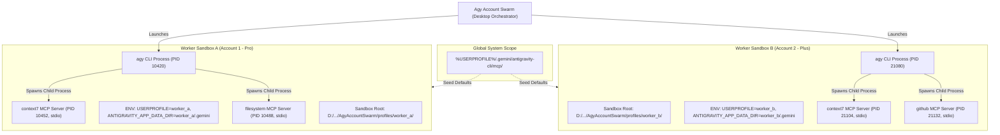

# Model Context Protocol (MCP) Architecture & Guide for Antigravity AI

## 1. Core Architectural Concept: Is MCP Per-CLI, Per-Account, or Global?

> [!IMPORTANT]
> **Definitive Architecture Answer**:
> In Antigravity CLI and Agy CLI Account Swarm, **MCP execution is strictly Per-CLI Instance (per-worker session)**, while **MCP configuration can be configured per-account sandbox or inherited from global system presets**.



### Key Dimensions of the Architecture

| Dimension | Scope | Technical Behavior |
| :--- | :--- | :--- |
| **Process Execution** | **Per-CLI Instance** | Each `agy` CLI process spawns independent child processes for each MCP server over standard I/O (`stdio`). |
| **Memory & State** | **Isolated per Worker** | Zero cross-talk. If Worker A queries `context7`, Worker B's memory and rate limits are completely untouched. |
| **Sandbox Configuration** | **Per-Account Profile** | Profiles can define their own dedicated `.gemini/antigravity-cli/mcp/` or `mcp_config.json`. |
| **Default Fallback** | **Global System** | If a worker profile lacks an override, it automatically inherits base configurations from the user's primary `.gemini` folder. |
| **Desktop App UI (`/mcp`)** | **Catalog & Inspector** | Inspects active system MCP configurations, schemas, and eager/lazy tool manifests. |

---

## 2. Process Lifecycle & Execution Flow

When you click **Start Conversation** or **Run Swarm** in Agy Account Swarm:

1. **Environment Sandbox Scoping**:
   `TerminalLauncherService` generates a dedicated startup launcher (`run-agy.cmd`) configuring:
   ```cmd
   SET "USERPROFILE=C:\Users\rifky\AppData\Roaming\AgyAccountSwarm\profiles\worker_xyz"
   SET "HOME=%USERPROFILE%"
   SET "ANTIGRAVITY_APP_DATA_DIR=%USERPROFILE%\.gemini"
   ```
2. **CLI Initialization**:
   `agy` starts inside the sandbox and checks its local `.gemini/antigravity-cli/mcp` directory and `mcp_config.json`.
3. **Child Process Spawn**:
   `agy` initiates each configured MCP server (e.g. `node.exe server.js` or `python -m server`) as a direct child process.
4. **JSON-RPC Communication**:
   All communication occurs locally over standard streams (`stdin` and `stdout`) adhering to the Model Context Protocol JSON-RPC specification.
5. **Termination**:
   When the `agy` session finishes or is closed, the operating system terminates the worker process tree, safely closing all child MCP servers.

---

## 3. Supported MCP Integration Modes

Antigravity AI distinguishes between two tool resolution strategies:

### 1. Eagerly Loaded MCP Servers
- **Behavior**: Loaded and initialized at CLI boot time.
- **Tools**: Exposed directly in the agent's main tool namespace alongside native tools.
- **Best For**: Core file system operations, local terminal utilities, or tools required on almost every turn.

### 2. Lazily Loaded MCP Servers
- **Behavior**: Discovered via JSON schemas stored in `~/.gemini/antigravity-cli/mcp/<serverName>/*.json`.
- **Tools**: Resolved on-demand via `call_mcp_tool`. The agent only queries documentation or loads heavy schemas when contextually relevant.
- **Example**: `context7` (library lookup, framework docs), database querying, browser automation.

---

## 4. How to Configure MCP Servers

### A. Global System Configuration (All Workers)
Create or edit `%USERPROFILE%\.gemini\config\mcp_config.json`:
```json
{
  "mcpServers": {
    "context7": {
      "command": "node",
      "args": ["C:/Users/rifky/.gemini/mcp/context7/index.js"],
      "env": {
        "DEBUG": "false"
      }
    },
    "filesystem": {
      "command": "npx",
      "args": ["-y", "@modelcontextprotocol/server-filesystem", "D:/Works"]
    }
  }
}
```

### B. Worker-Specific Configuration (Single Account Sandbox)
To equip a specific worker with specialized tools (e.g., GitHub PR bot, PostgreSQL schema tool):
1. Navigate to the profile directory:
   `%APPDATA%\AgyAccountSwarm\profiles\<ProfileName>\`
2. Create `.gemini\config\mcp_config.json` inside that profile's sandbox.
3. Add only the MCP tools intended for that specific account.

---

## 5. Summary Cheat Sheet

- **Does Account B see Account A's MCP data?** No. Separate processes and sandbox paths.
- **If an MCP crashes in Worker A, does Worker B stop?** No. PIDs and standard streams are completely isolated.
- **Can different workers have different MCP servers?** Yes. Place custom `mcp_config.json` in each worker's profile directory.
- **What does the Desktop App `/mcp` page show?** The central catalog of available MCP servers, tool schemas, and connection diagnostics.
