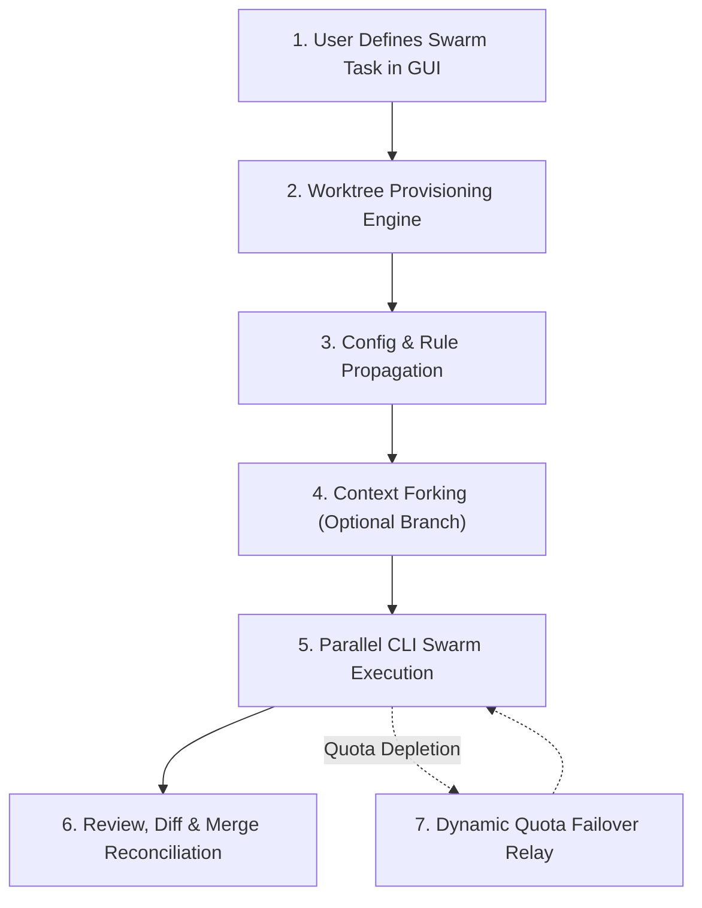

# Swarm Propagation & Git Worktree Architecture (Next Features Roadmap)

> **Document Status**: Architectural Design & Roadmap Specification  
> **Target Version**: v1.0.0+  
> **Repository**: [agy-cli-account-swarm](https://github.com/RifkyA911/agy-cli-account-swarm)  
> **Scope**: Desktop GUI Orchestrator for Google Antigravity CLI (`agy`)

---

## 📌 Executive Summary

As **Agy CLI Account Swarm** matures from an account sandboxing utility into a full multi-agent orchestration control tower, the next major evolutionary phase is **Swarm Propagation**: the ability to distribute tasks, configuration, and conversation context across multiple sandboxed Google accounts while executing code changes concurrently on a shared codebase.

Executing multiple AI agents simultaneously against the same repository introduces two fundamental challenges:
1. **Repository Lock Contention**: Running multiple CLI agents in the same working directory causes fatal collisions on `.git/index.lock`, dirty working trees, and file-write race conditions.
2. **Quota & Rate-Limit Management**: Balancing tasks across Google's rolling 5-hour demand window and weekly tier quotas (Basic = 100 turns, Plus = 300, Pro = 1,000, Ultra = 2,500) requires a disciplined, ToS-compliant handoff mechanism.

This specification details how **Git Worktree (`git worktree`)** and **Deterministic Context Propagation** solve these problems cleanly, realistically, and in strict compliance with Google Terms of Service.

---

## 🌳 Why Git Worktree is the Core Foundation

Traditional approaches to running multiple agents on one project either:
- **Share a single working directory** ➔ Leads to `.git/index.lock` collisions, clashing edits, and uncommitted change overrides.
- **Clone the entire repository *N* times** ➔ Wastes tens of gigabytes of disk space, duplicates remote fetches, and fragments version control history.

### The Git Worktree Advantage
Git Worktree allows a single local repository (`.git`) to support multiple linked working directories simultaneously:

```
[Main Repository: D:/Projects/MyApp/.git]
   │
   ├── Working Tree 1 (Master / Main Branch): D:/Projects/MyApp
   │     └─ Assigned to: Default (Main Account) [Gemini 2.5 Pro]
   │
   ├── Linked Worktree 2 (Branch: swarm/worker-alpha): D:/Projects/MyApp-worktrees/worker-alpha
   │     └─ Assigned to: Worker Alpha [Gemini 2.5 Flash]
   │
   └── Linked Worktree 3 (Branch: swarm/worker-beta): D:/Projects/MyApp-worktrees/worker-beta
         └─ Assigned to: Worker Beta [Claude 3.7 Sonnet]
```

### Key Technical Benefits:
1. **Shared Git Object Database**: No repository duplication. All commits, objects, and refs live in the single `.git` folder. Worktree folders only contain the checked-out files.
2. **Zero Lock Collisions**: Each worktree has its own dedicated `.git/worktrees/{id}/index`. Worker 1 staging files never locks or blocks Worker 2.
3. **Parallel Branch Exploration**: Each worker develops on an isolated branch (`swarm/worker-alpha`, `swarm/worker-beta`), allowing competing implementation ideas to be explored concurrently.
4. **Clean Merge & Diff Pipeline**: Once agents finish their tasks, the desktop GUI can inspect branch diffs and perform standard `git merge` or `git rebase` back to the main branch.

---

## 🔄 Complete Swarm Inflow Pipeline

The complete end-to-end operational flow for a propagated swarm task follows 6 deterministic stages:



### Stage 1: Task Definition & Model Assignment
The user specifies the prompt or objective in the GUI control tower and selects which account profiles will participate. Each profile can be assigned a specific model persona based on its tier:
- **Worker 1 (Flash)**: Rapid prototyping, boilerplate generation, unit test scaffolding.
- **Worker 2 (Pro)**: Deep architectural refactoring, complex logic implementation, security audits.
- **Worker 3 (Claude/3P)**: Secondary cross-examination, code review, documentation generation.

### Stage 2: Automated Worktree Provisioning
The application executes native git worktree commands to create linked workspaces:
```bash
# Executed automatically by AgyAccountSwarm Worktree Service:
git worktree add -b swarm/worker-alpha ../.worktrees/worker-alpha HEAD
git worktree add -b swarm/worker-beta ../.worktrees/worker-beta HEAD
```
Each worker's `AccountProfile.DefaultWorkspace` is dynamically anchored to its respective worktree folder.

### Stage 3: Configuration & Rule Propagation
Master customization settings are propagated from the host environment to the worker sandboxes (`~/.gemini-profiles/{id}/`):
- **Rules Propagation**: Copies or symlinks project-level `GEMINI.md` and `.gemini/` rules.
- **MCP Tool Presets**: Propagates baseline MCP server configurations (`mcp_config.json`) so all workers share identical database connectors, filesystem servers, or documentation indexers.
- **Granular Overrides**: Each profile retains local override settings (e.g., Worker 1 can use a stricter temperature or different model flags).

### Stage 4: Context Forking & Transcript Handoff
When branching an ongoing conversation:
1. The active session's turn logs (`history.jsonl` and `conversations/*.db`) are exported from the source profile.
2. The session is cloned into the target worker's sandbox under a new unique Conversation ID.
3. The worker is launched with `--conversation <new_id>`, allowing it to immediately pick up from the exact turn state of the parent without polluting the parent's conversation database.

### Stage 5: Parallel Swarm Execution (Fan-Out)
The terminal multiplexer launches the CLI workers across their isolated worktrees. Because each worker runs in its own process tree with dedicated environment variables (`USERPROFILE`, `HOME`, `ANTIGRAVITY_APP_DATA_DIR`):
- Terminal split-panes display live progress simultaneously.
- Telemetry sensors parse each worker's `history.jsonl` in real time, updating turns consumed, token metrics, and active model state in the GUI.

### Stage 6: Diff Review & Reconciliation (Fan-In)
When execution concludes:
1. The GUI highlights which branches have uncommitted changes or new commits.
2. An interactive diff view compares the branches generated by the workers against `master`.
3. The user can select the best solution and trigger a clean `git merge`, or cherry-pick specific commits.
4. Temporary worktrees can be cleanly removed (`git worktree remove ../.worktrees/worker-alpha`) with 1 click.

---

## ⚡ Dynamic Quota Failover Relay (Estafet Kuota)

Google enforces strict dual-window capacity ceilings:
- **5-Hour Rolling Limit**: Smooths out aggregate demand.
- **Weekly Tier Limit**: Hard ceiling proportional to subscription tier.

### Realistic Failover Workflow:
1. **Sentinel Detection**: The background `AgyUsageParser` detects that Worker A's `gemini-5h` remaining fraction has dropped below a critical threshold (e.g., `< 5%` or `0%`).
2. **Graceful Turn Completion**: The system allows Worker A to finish its current turn rather than abruptly killing the process.
3. **State Serialization**: The latest session state, workspace file changes, and conversation turn history are serialized locally.
4. **Relay Transfer**: Worker B (with fresh quota headroom) is provisioned with Worker A's linked worktree and imported conversation history.
5. **Session Continuation**: Worker B is triggered with `agy --conversation <transferred_id>`, seamlessly continuing the automated task without developer intervention.

---

## ⚖️ Google Policies & Terms of Service Compliance

Maintaining strict compliance with Google's Terms of Service and Generative AI Policies is the paramount design constraint of this project.

| Practice | Status | Implementation Standard |
| :--- | :---: | :--- |
| **Separate Google Accounts** | ✅ Compliant | Each profile must authenticate via its own authentic OAuth flow. |
| **No Credential Sharing** | ✅ Compliant | OAuth tokens are never cloned, merged, or transmitted upstream. |
| **Authentic Telemetry** | ✅ Compliant | Zero mock data. Quota parsed strictly from official `agy -p "/usage"` output. |
| **Respect Capacity Limits** | ✅ Compliant | No attempt to spoof client IDs, bypass 5-hour windows, or evade throttles. |
| **Local Disk Operations** | ✅ Compliant | All worktree operations, chat transfers, and logs are 100% on local disk. |
| **Independent Software** | ✅ Compliant | Clearly documented as an independent open-source tool not affiliated with Google. |

---

## 🗺️ Implementation Phases

```
Phase 1: Worktree Service (v0.9.7-beta)
  ├── GitWorktreeService implementation (add, list, prune, remove)
  ├── Worktree selection UI inside Profile Edit Dialog
  └── Auto-branch naming convention (swarm/{profile-name})

Phase 2: Config & Rule Propagator (v0.9.8-beta)
  ├── Master GEMINI.md & settings.json sync engine
  ├── MCP server preset propagation
  └── In-app sync status indicator

Phase 3: Context Forking & Swarm Fan-Out (v0.9.9-beta)
  ├── 1-click Fork & Propagate conversation action
  ├── Multi-terminal prompt broadcast launcher
  └── Unified branch diff viewer in Analytics/Docs

Phase 4: Dynamic Quota Failover (v1.0.0)
  ├── Auto-relay state machine
  ├── 5-hour limit threshold sentinel
  └── Seamless session handoff engine
```

---

## 🖥️ Platform Architecture Clarification

- **Current Repository (`agy-cli-account-swarm`)**: Exclusively a **GUI Desktop Application** built with WPF on .NET 9 for Windows.
- **Linux & macOS Support**: Running natively requires Avalonia GUI (planned for future cross-platform release). On Linux today, the application runs via Wine runtime.
- **Headless CLI Interface**: A standalone command-line orchestrator will be developed as a separate project under the name **`agy-swarm`**.
