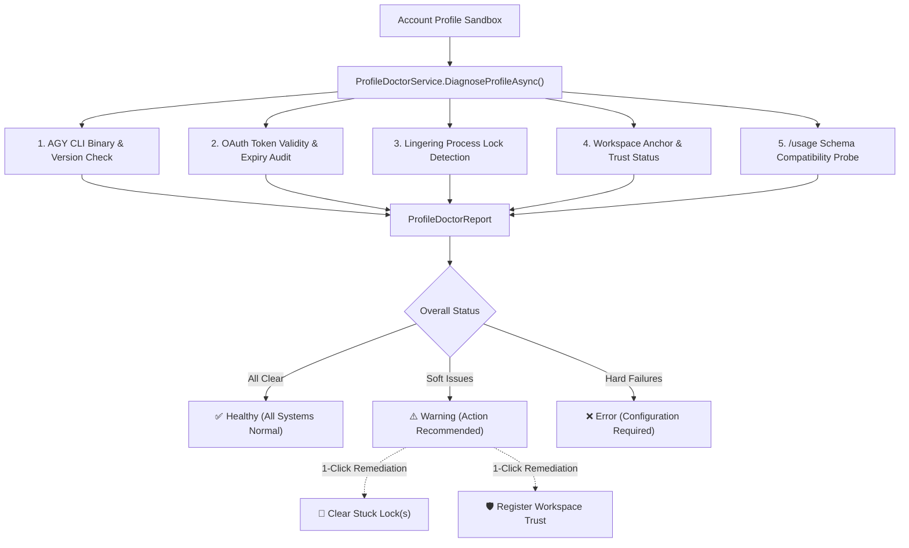

# Profile Doctor & Diagnostic Engine 🩺

> **Component**: `AgyAccountSwarm.Services.ProfileDoctorService`  
> **Status**: Production (v0.9.6-beta+)  
> **Scope**: Automated 5-Checkpoint Health Audit & Remediation for Sandboxed Google Antigravity CLI Instances

---

## 📌 1. Overview & Purpose

When running multiple concurrent Antigravity AI (`agy`) agent workers, sandbox health can degrade due to:
- Expired or invalidated Google OAuth tokens.
- Zombie processes leaving behind unreleased presence locks (`presence/*.lock`).
- Unregistered or untrusted workspace folders prompting modal blocks.
- Corrupted CLI binary installations or path misconfigurations.
- Upstream changes to `agy -p "/usage"` JSON output schemas.

**Profile Doctor** is an embedded diagnostic system that provides real-time health auditing and 1-click self-healing remediation for each profile sandbox.



---

## 🔍 2. The 5 Diagnostic Checkpoints in Detail

### Checkpoint 1: AGY CLI Binary & Version (`cli_version`)
- **What it does**: Verifies that the Google Antigravity CLI executable (`agy` or custom configured path) is installed, reachable in `PATH`, and returns a valid version string via `agy --version`.
- **Failure Conditions**:
  - `agy` not found in `PATH` or custom path.
  - Process execution error (e.g. Win32 permission denied, missing execution bit on POSIX).
- **Remediation Action**: Ensure `agy` is installed (`npm install -g @google/antigravity` or standalone installer) and accessible from system PATH, or set the executable path explicitly in Application Settings.

### Checkpoint 2: OAuth Token Validity & Freshness (`oauth_token`)
- **What it does**: Inspects the sandbox's `antigravity-oauth-token` file, validates that it contains valid UTF-8 JSON without BOM, and decodes the JWT claims to verify expiration timestamp (`exp`).
- **Status Indicators**:
  - `✅ Passed`: Token exists, parses cleanly, and expiration is well in the future.
  - `⚠️ Warning`: Token is approaching expiration (< 24 hours remaining).
  - `❌ Failed`: Token file missing (`Needs Login`), corrupted, or expired.
- **Remediation Action**: Click **Launch agy** on the account card to perform interactive browser login inside the isolated terminal shell.

### Checkpoint 3: Lingering Process Locks (`process_locks`)
- **What it does**: Scans the sandbox's `.gemini/antigravity-cli/presence/` directory and active SQLite databases (`*.db-journal`, `*.db-wal`) for lingering lock files left behind by ungracefully terminated worker processes.
- **Why it matters**: Lingering locks prevent new CLI instances from starting, resulting in `Resource temporarily unavailable` or `database is locked` fatal errors.
- **Remediation Action**: Click **🧹 Clear Stuck Lock(s)**. The service safely purges stale lock files while preserving active database integrity.

### Checkpoint 4: Workspace Anchor & Trust Registration (`workspace_trust`)
- **What it does**: Verifies that the configured `DefaultWorkspace` directory exists on disk, is writable, and is registered in the CLI's `trusted_workspaces.json`.
- **Why it matters**: Untrusted directories cause `agy` to halt execution on startup, awaiting interactive user confirmation to trust the workspace folder. In automated swarm operations, this freezes the worker.
- **Remediation Action**: Click **Register Workspace Trust** or update the directory path in the Profile Edit Dialog.

### Checkpoint 5: `/usage` Schema Compatibility Probe (`usage_schema`)
- **What it does**: Invokes `agy -p "/usage" --output-format json` inside the profile sandbox and inspects the JSON payload structure against the expected `command.data.groups[].buckets` schema.
- **Why it matters**: Antigravity CLI updates may alter telemetry keys or JSON hierarchies. This checkpoint verifies that the desktop app's `AgyUsageParser` can extract 5-hour and weekly capacity limits accurately.
- **Zero Token Guarantee**: The probe consumes exactly **0 agent turns** and **0 model tokens**.
- **Remediation Action**: Update `Agy CLI Account Swarm` to the latest release if Google updates the CLI output format.

---

## 🛠️ 3. One-Click Self-Healing Remediation

Profile Doctor is not merely a passive diagnostic reporter—it provides active remediation routines:

### A. Stuck Lock Purge (`CleanStuckLocksAsync`)
```csharp
public async Task<int> CleanStuckLocksAsync(AccountProfile profile)
{
    var profileDir = profile.GetEffectiveProfileDirectory();
    var presenceDir = Path.Combine(profileDir, ".gemini", "antigravity-cli", "presence");
    int deletedCount = 0;

    if (Directory.Exists(presenceDir))
    {
        foreach (var file in Directory.GetFiles(presenceDir, "*.lock"))
        {
            try
            {
                File.Delete(file);
                deletedCount++;
            }
            catch (Exception ex)
            {
                Logger.Warn($"Could not delete lock file {file}: {ex.Message}");
            }
        }
    }
    return deletedCount;
}
```

### B. Workspace Trust Provisioning (`AddWorkspaceToTrustedAsync`)
Automatically appends the profile's designated workspace path into the sandbox's `trusted_workspaces.json`, bypassing interactive security prompts during automated swarm launches.

---

## 📊 4. Diagnostic Status Lifecycle & UI Badges

| Status | Badge Color | Icon | Description |
| :--- | :--- | :---: | :--- |
| **Passed** | `#10B981` (Emerald) | `✅` | All 5 checkpoints passed without issues. Worker is 100% operational. |
| **Warning** | `#F59E0B` (Amber) | `⚠️` | Non-fatal condition detected (e.g. stale lock files, token near expiry). Self-healing actions available. |
| **Failed** | `#EF4444` (Crimson) | `❌` | Hard error preventing CLI execution (e.g. missing binary, missing OAuth login). |

---

## ⚡ 5. Integration with Quick Sync

Profile Doctor runs automatically during:
1. **Application Startup**: If `AutoCheckAuthOnStartup` is enabled in Settings.
2. **Discrete Single-Account Quick Sync**: Clicking the sync icon (`🔄`) on any Account Card header runs Profile Doctor for that specific sandbox in milliseconds without loading or pausing other profiles.
3. **Swarm Health Audit**: Pre-flight verification before batch swarm launches.
