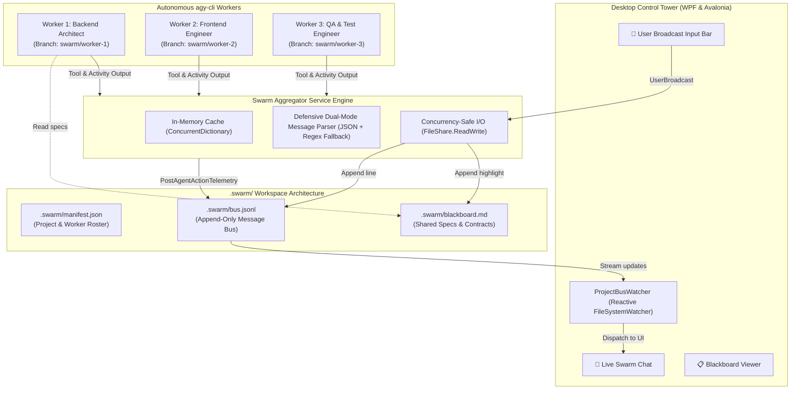

# Swarm Aggregator & Inter-Agent Bus Architecture 🛰️

> **Comprehensive Technical Specification & Guide for Multi-Account `agy-cli` Orchestration, Shared State Blackboard, and Reactive Telemetry Bus.**

---

## 1. Executive Summary

When running multiple autonomous Google Antigravity CLI (`agy`) instances concurrently across different Google accounts, agents naturally operate in isolated sandbox workspaces to prevent OAuth credential collisions and filesystem locks (`presence/*.lock`). 

However, autonomous engineering requires **inter-worker communication, shared technical contracts, and centralized telemetry**. 

The **Swarm Aggregator (`ISwarmAggregatorService` / `SwarmAggregatorService`)** is the high-performance, zero-dependency coordination engine that unifies multiple distributed `agy` CLI processes into a cohesive software development swarm without requiring heavy networking servers, Redis, or external brokers.



---

## 2. Directory & File System Specifications

For every registered Swarm Project, the Aggregator maintains a standardized `.swarm/` workspace directory located in the project's root folder:

```
<ProjectRoot>/
├── .swarm/
│   ├── manifest.json       <-- Fleet roster, roles, models, and metadata
│   ├── bus.jsonl           <-- Append-only inter-worker message stream
│   ├── blackboard.md       <-- Human & LLM-readable shared technical contracts
│   └── swarm-root.txt      <-- Pointer reference for linked sandbox workspaces
├── (Source code / Git repository)
```

### 2.1 `.swarm/manifest.json`
Contains the static and runtime roster of the swarm:
```json
{
  "projectId": "a81d4e2a-7f61-456b-a25e-9f33b1e32881",
  "projectName": "E-Commerce Gateway",
  "techStack": "C# / ASP.NET Core & React",
  "rootDirectory": "D:\\Projects\\e-commerce-gateway",
  "createdAt": "2026-10-03T10:00:00Z",
  "workers": [
    {
      "id": "prof-1",
      "name": "BackendLead",
      "role": "Backend Architect",
      "email": "lead@company.com",
      "tier": "Pro"
    },
    {
      "id": "prof-2",
      "name": "FrontendUI",
      "role": "Frontend Specialist",
      "email": "ui@company.com",
      "tier": "Ultra"
    }
  ]
}
```

### 2.2 `.swarm/bus.jsonl`
An append-only JSON Lines stream storing all communications, agent milestones, telemetry summaries, and user broadcasts. Each line is an independent JSON object serialized according to the `SwarmChatMessage` schema.

### 2.3 `.swarm/blackboard.md`
A Markdown-formatted blackboard updated dynamically by both the orchestrator and agents. Markdown was deliberately selected because LLMs like Gemini 2.5 natively excel at inspecting, structuring, and updating Markdown documents without strict JSON escaping friction.

### 2.4 Worker Sandbox Linking
When workers operate in isolated profile directories (e.g. `~/.gemini-profiles/profile-{id}/workspace/<project>/`), the aggregator creates a `.swarm/swarm-root.txt` inside the worker's workspace pointing directly to the shared project root, enabling scripts and hooks to seamlessly locate the central bus.

---

## 3. Message Protocol & Schema (`SwarmChatMessage`)

Every event on the bus is represented by a `SwarmChatMessage` with the following attributes:

| Field | Type | Description |
| :--- | :--- | :--- |
| `id` | `string` | Unique GUID representing the message instance. |
| `projectId` | `string` | Target project ID. |
| `senderName` | `string` | Profile name of the worker, `"You (User)"`, or `"Swarm Orchestrator"`. |
| `senderRole` | `string` | Domain role (e.g., `Backend Architect`, `Commander`, `System`). |
| `senderColor` | `string` | Hex color code used for badges and avatars (e.g., `#3B82F6`). |
| `avatarUrl` | `string?` | Google account profile picture URL (or null). |
| `avatarInitial`| `string` | Single-letter fallback initial (e.g., `"B"`, `"F"`, `"U"`). |
| `content` | `string` | The text message, activity summary, or milestone description. |
| `type` | `enum` | Message classification (`0` to `4`). |
| `timestamp` | `DateTime` | UTC timestamp of event creation. |
| `targetWorker` | `string?` | Optional target worker name (`null` for broadcasts to all workers). |

### Message Types (`SwarmMessageType`):
1. **`UserBroadcast` (Type 0)**: Instructions issued by the user to the entire swarm or targeted to a specific worker (`@WorkerName`). Rendered in Deep Navy with electric blue accent.
2. **`AgentMessage` (Type 1)**: Direct messages sent from an agent to peers or the commander.
3. **`AgentAction` (Type 2)**: Summarized telemetry of an agent performing a tool call, running tests, or writing files. Rendered in Dark Forest Emerald.
4. **`SystemEvent` (Type 3)**: Lifecycle events (swarm initialization, worktree creation, process launch/exit). Rendered in Dark Slate with Indigo accent.
5. **`Handoff` (Type 4)**: Milestone completion signal indicating readiness for downstream peers. Rendered in Regal Purple.

---

## 4. Concurrency Safety & Defensive Ingestion

### 4.1 Non-Blocking Multi-Process File Sharing (`FileShare.ReadWrite`)
Standard .NET APIs like `File.ReadAllLinesAsync` or `File.AppendAllTextAsync` open files using exclusive read locks or `FileShare.Read`. In a multi-worker swarm, multiple `agy` instances and the GUI app could write simultaneously, resulting in fatal `IOException: The process cannot access the file ...`.

The Swarm Aggregator explicitly configures low-level file streams with `FileShare.ReadWrite`:
```csharp
using var stream = new FileStream(busFile, FileMode.Append, FileAccess.Write, FileShare.ReadWrite);
using var writer = new StreamWriter(stream, new UTF8Encoding(false));
await writer.WriteLineAsync(line);
```
This guarantees zero file-locking collisions across concurrent background CLI workers, interactive terminals, and UI threads.

### 4.2 Fault-Tolerant Fallback Parser
If an external bash script, developer, or CLI process appends raw text to `.swarm/bus.jsonl` instead of valid JSON, the aggregator does **not** crash or discard the line. It falls back to parsing bracket headers:
- `[Worker-1 (Backend Architect)]: Finished migration` &rarr; Ingested with `SenderName="Worker-1"`, `SenderRole="Backend Architect"`.
- `Plain unformatted text` &rarr; Ingested as an `AgentAction` from `"External Agent"`.

---

## 5. Real-Time Reactive Streaming (`SubscribeProjectBus`)

Instead of requiring expensive full-file polling or manual refresh clicks, `SwarmAggregatorService.SubscribeProjectBus` uses an event-driven `FileSystemWatcher` combined with **byte-offset tracking**:

```
[bus.jsonl: 1,420 bytes] 
       │ 
       ▼ (Worker appends 250 bytes)
[FileSystemWatcher fires Changed event]
       │
       ▼ (Debounce 80ms for flush completion)
[Open stream with FileShare.ReadWrite]
       │
       ▼ (Seek directly to offset 1,420)
[Read only the new 250 bytes -> Parse new lines]
       │
       ▼ (Update offset to 1,670 bytes)
[Dispatch new messages to UI: WPF / Avalonia Thread]
```

### Benefits:
- **Near-Zero CPU Usage**: The watcher remains idle until disk writes occur.
- **Ultra-Fast UI Updates**: New messages appear in the live feed within milliseconds.
- **Zero Duplication**: Byte-offset tracking prevents re-reading historical lines.

---

## 6. How to Interact with the Bus from CLI & Scripts

Any external tool, Git hook, or command can communicate with the active swarm by appending to `.swarm/bus.jsonl`:

### PowerShell:
```powershell
$msg = @{
    projectId = "my-project-id"
    senderName = "DevOps Pipeline"
    senderRole = "CI/CD"
    senderColor = "#F59E0B"
    content = "Build #42 passed: 138 unit tests green."
    type = 2 # AgentAction
    timestamp = [DateTime]::UtcNow.ToString("o")
} | ConvertTo-Json -Compress

Add-Content -Path ".swarm\bus.jsonl" -Value $msg
```

### Bash / Shell:
```bash
echo '{"senderName":"Linter","senderRole":"Code Quality","content":"ESLint completed with 0 errors.","type":2}' >> .swarm/bus.jsonl
```

### Simple Text Fallback:
```bash
echo "[SecurityBot (Audit)]: Dependencies audited. Zero CVEs found." >> .swarm/bus.jsonl
```
The aggregator's fallback engine will automatically parse and display this in the live desktop chat feed!
