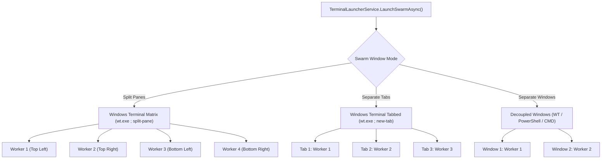
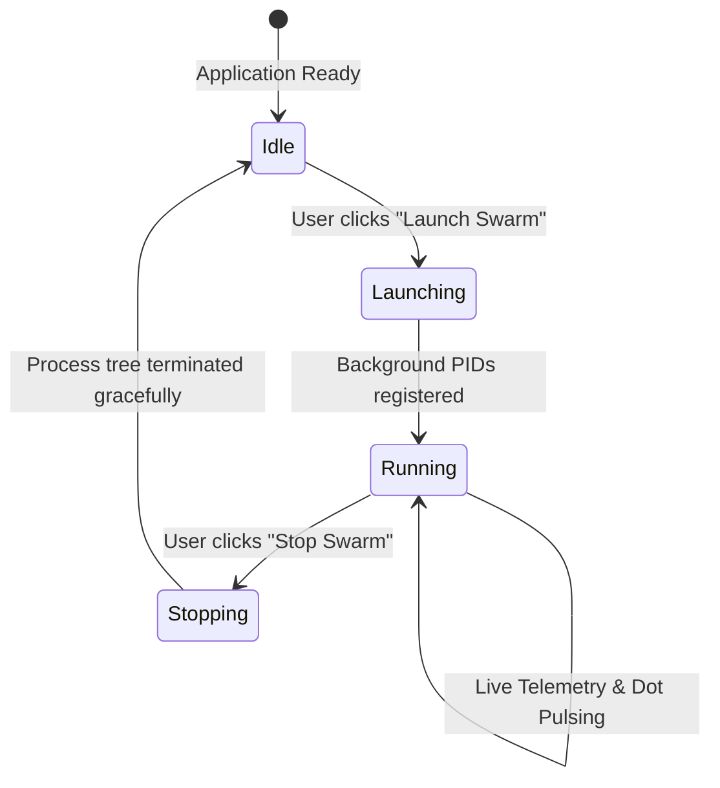

# Swarm Execution Workflows & Multiplexer Architecture 🚀

> **Components**: `TerminalLauncherService`, `MainViewModel`, `ProfileItemViewModel`  
> **Status**: Verified Production Standard (v0.9.7-beta+)  
> **Scope**: Multi-Session Terminal Multiplexing, Swarm Lifecycle Management, and Dynamic State Tracking.

---

## 📌 1. Swarm Execution Modes

Agy CLI Account Swarm orchestrates multiple Antigravity AI accounts through three distinct terminal layout models, configurable in **Settings > Swarm Window Mode**:



### Mode 1: Split Panes (`wt.exe ; split-pane`)
- **Behavior**: Arranges all selected accounts into an auto-tiled grid within a single Windows Terminal instance.
- **Multiplexer Command Syntax**:
  ```bash
  wt.exe -w 0 new-tab -p "Command Prompt" --title "Worker 1" -d "D:\App1" cmd.exe /k "C:\sandboxes\p1\run-agy.cmd" ; split-pane -H -p "Command Prompt" --title "Worker 2" -d "D:\App2" cmd.exe /k "C:\sandboxes\p2\run-agy.cmd" ; split-pane -V -p "Command Prompt" --title "Worker 3" -d "D:\App3" cmd.exe /k "C:\sandboxes\p3\run-agy.cmd"
  ```
- **Best For**: High-density multi-agent orchestration, comparing different LLMs (Gemini Pro vs Flash vs Claude) solving the same refactor task side-by-side.

### Mode 2: Separate Tabs (`wt.exe ; new-tab`)
- **Behavior**: Opens each active account in its own dedicated tab inside Windows Terminal.
- **Command Syntax**:
  ```bash
  wt.exe -w 0 new-tab --title "Worker 1" cmd.exe /k "run-agy.cmd" ; new-tab --title "Worker 2" cmd.exe /k "run-agy.cmd"
  ```
- **Best For**: Developers focusing on one worker at a time while easily switching tabs via `Ctrl+Tab`.

### Mode 3: Separate Windows
- **Behavior**: Launches an independent terminal window for each worker.
- **Best For**: Multi-monitor setups where workers are distributed across physical displays.

---

## ⚡ 2. Single-Account Launch Variations

On each individual Account Card, the primary action button and dropdown provide 4 distinct launch flows:

| Launch Option | Invocation Command | Ideal Use Case |
| :--- | :--- | :--- |
| **✨ New Chat (Fresh Session)** | `agy` | Default interactive conversation session with clean context. |
| **🔄 Continue Recent Session** | `agy -p "/continue"` | Automatically resumes the most recent conversation transcript in the workspace. |
| **💬 Resume Specific Conversation** | `agy --conversation <id>` | Resumes an exact past conversation selected from the in-popup search list. |
| **💻 Sandbox Terminal Shell** | `run-agy.cmd --cli-only` | Opens an isolated Command Prompt / PowerShell configured with the sandbox environment, ready for custom prompts or scripts. |

---

## 🛑 3. Dynamic Swarm Process Lifecycle (Launch & Stop Swarm)

Agy Account Swarm actively manages worker processes throughout their execution:



### Lifecycle Mechanics:
1. **PID Tracking**: When `LaunchSwarmAsync` executes, the root Windows Terminal or child process IDs (PIDs) are saved in memory.
2. **Dynamic Button State**:
   - When idle: Button displays emerald green **`🚀 Launch Swarm`**.
   - When workers are active: Button dynamically shifts to crimson red **`🛑 Stop Swarm`**.
3. **Graceful Swarm Termination (`StopSwarmAsync`)**:
   - Clicking **`Stop Swarm`** issues a termination command across the recorded process tree.
   - Any stale `.lock` presence files left by interrupted workers are cleaned automatically via `ProfileDoctorService`.
4. **Status Dot Indicator**:
   - An active status dot glows emerald green on the account avatar while the worker is running.
   - Reverts to subtle slate gray when the session ends or is stopped.

---

## 🔄 4. Process State Machine

Each account profile transitions through a deterministic state machine:

```
[Uninitialized] ──(Profile Scaffolded)──> [Needs Login]
                                                │
                                  (OAuth Login Completed)
                                                │
                                                v
[Quota Exhausted] <──(Usage > 100%)─── [Authenticated]
       │                                        │
 (Midnight UTC Reset)                     (Launch Terminal)
       │                                        │
       └──────────────────────────────────> [Running]
```

1. **Uninitialized**: Directory structure not yet created.
2. **Needs Login**: Sandbox directory initialized, awaiting Google OAuth token.
3. **Authenticated**: Active Google OAuth identity verified, email claims parsed, model limits available.
4. **Running**: One or more interactive CLI terminal sessions actively running.
5. **Quota Exhausted**: 5-hour rolling limit or daily prompt limit reached. Quota bar turns crimson red, warning chime sounds. Automatically recovers when Google capacity resets (00:00 UTC or 5-hour window).
