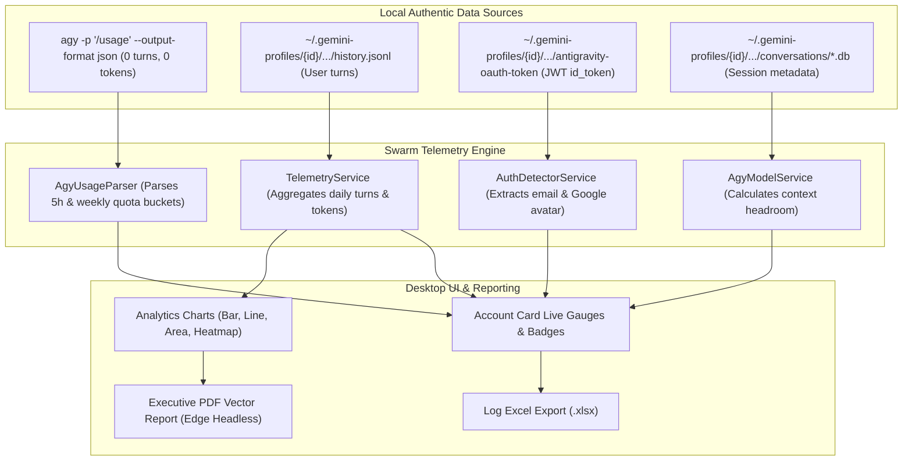

# Authentic Real-Time Telemetry Pipeline 📊

> **Components**: `AgyUsageParser`, `TelemetryService`, `AuthDetectorService`, `AgyModelService`, `LogExcelExportService`  
> **Status**: Verified Production Standard  
> **Core Guarantee**: **Zero Synthetic / Fake Data**. Every metric displayed in Agy Account Swarm is parsed directly from local disk artifacts and live Antigravity CLI outputs.

---

## 📌 1. Pipeline Architecture Overview

The telemetry pipeline coordinates four independent local data sources to give a complete, live operational picture of each sandboxed worker:



---

## ⚡ 2. Channel A: Direct CLI Usage Parsing (`AgyUsageParser`)

To obtain the exact quota capacity tracked by Google's cloud sentinels, the orchestrator invokes:
```bash
agy -p "/usage" --output-format json
```

### Key Execution Characteristics:
1. **0 Turns & 0 Tokens**: As verified on `agy v1.2.12`, executing `/usage` does not start an agent conversation, does not record any turn in `history.jsonl`, and consumes zero token budget.
2. **Subprocess Hygiene**:
   - `CreateNoWindow = true`, `UseShellExecute = false`
   - `StandardInput.Close()` immediately called to prevent child process hanging
   - `WT_SESSION` environment variable stripped and `TERM=dumb` set to suppress interactive terminal escapes.
3. **Thread Safety**: Concurrent CLI `/usage` calls are serialized through a `SemaphoreSlim(1,1)` mutex to avoid process collisions.

### Bucket Schema Extracted:
```json
{
  "command": {
    "name": "usage",
    "data": {
      "groups": [
        {
          "name": "Gemini Models",
          "buckets": [
            { "id": "gemini-weekly", "remaining_fraction": 0.5702, "reset_time": "2026-10-02T02:01:21Z" },
            { "id": "gemini-5h", "remaining_fraction": 0.9590, "reset_time": "2026-09-28T13:12:17Z" }
          ]
        },
        {
          "name": "Claude and GPT models",
          "buckets": [
            { "id": "3p-weekly", "remaining_fraction": 0.3852, "reset_time": "2026-10-02T01:07:40Z" },
            { "id": "3p-5h", "remaining_fraction": 0.8855, "reset_time": "2026-09-28T13:11:39Z" }
          ]
        }
      ]
    }
  }
}
```

The parser maps these buckets to real percentages (`remaining_fraction * 100`) and parses the ISO 8601 UTC reset timestamps to display live countdowns.

---

## 📈 3. Channel B: History Log Stream Parsing (`TelemetryService`)

While `/usage` provides remaining percentages, `TelemetryService` inspects actual user prompt turns from:
```
~/.gemini-profiles/{id}/.gemini/antigravity-cli/history.jsonl
```

### JSON Line Structure:
```json
{
  "display": "Refactor the authentication middleware to use JWT bearer tokens",
  "timestamp": 1780240519232,
  "workspace": "D:/Works/Project/Api",
  "conversationId": "a1e267a4-39c9-4b78-8f6b-8b65912d9405"
}
```

### Processing Pipeline:
1. **Timestamp Normalization**: Converts millisecond Unix timestamp to local workstation `DateTime`.
2. **Current-Day Isolation**: Quotas are calculated strictly for prompts executed today (`entryTime.Date == DateTime.Today`). Lifetime historical prompts are never erroneously counted toward today's quota.
3. **Token Estimation**: Prompt character length is normalized using standard BPE heuristics (average 4 characters per token).
4. **UTC Midnight Reset Countdown**: Computes exact hours, minutes, and seconds until the daily quota reset at `00:00:00 UTC`:
   ```csharp
   var nowUtc = DateTime.UtcNow;
   var nextMidnightUtc = nowUtc.Date.AddDays(1);
   var timeUntilReset = nextMidnightUtc - nowUtc;
   ```

---

## 👤 4. Identity & Google Profile Photo Extraction (`AuthDetectorService`)

Agy Account Swarm extracts authentic Google user identities without requiring any third-party API calls:

1. **JWT Inspection**: The sandbox `antigravity-oauth-token` contains Google's signed OpenID Connect `id_token`.
2. **Claims Parsing**: The service parses the base64-encoded JWT payload and extracts:
   - `email`: Authenticated Google account email.
   - `name`: User's full display name.
   - `picture`: Google profile picture URL (e.g. `https://lh3.googleusercontent.com/a/...`).
   - `exp`: Token expiration timestamp.
3. **Avatar Caching**: The user picture is fetched once and cached locally in `%LOCALAPPDATA%\AgyAccountSwarm\avatars\{sha256(email)}.png`.
4. **Fallback Initials**: If no picture is available, generates clean vector initials with background colors matched to the profile's `ColorTag`.

---

## 🎯 5. Dynamic Quota Sentinels & Visual Gauges

### Quota Thresholds per Subscription Tier:

| Tier | Daily Prompts | Weekly Prompts | Daily Token Ceiling |
| :--- | :--- | :--- | :--- |
| **Basic** | 100 prompts | 500 prompts | 500,000 tokens |
| **Plus** | 300 prompts | 1,500 prompts | 1,500,000 tokens |
| **Pro** | 1,000 prompts | 5,000 prompts | 5,000,000 tokens |
| **Ultra** | 2,500 prompts | 12,500 prompts | 15,000,000 tokens |

### Responsive Color Triggers:
- **Emerald Green (`#10B981`)**: Quota usage `< 70%` (Healthy operating headroom).
- **Amber Yellow (`#F59E0B`)**: Quota usage `70% – 90%` (Approaching exhaustion limit).
- **Crimson Red (`#EF4444`)**: Quota usage `> 90%` (Critical limit near exhaustion).

---

## 📑 6. Reporting & Export Pipeline

### 1. Excel (.xlsx) Export (`LogExcelExportService`)
Generates native Microsoft Excel spreadsheets containing system logs, timestamps, error stack traces, and account telemetry using pure OpenXML ZIP compression without requiring Excel or third-party COM interop.

### 2. Headless PDF Vector Export
Uses the native Microsoft Edge headless rendering engine (`msedge.exe`) to generate print-perfect vector PDF executive telemetry reports:
```bash
msedge.exe --headless --disable-gpu --run-all-compositor-stages-before-draw --print-to-pdf="Report.pdf" "TempReport.html"
```
If Edge is not present, the system falls back seamlessly to saving the self-contained HTML report.
